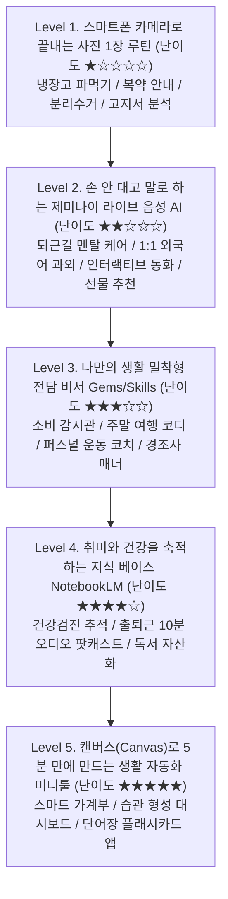

# 📱 [실전 가이드] 일상을 바꾸는 AI 실생활 활용 바이블 (스마트폰 & PC 실습 교재)
> **부제:** 코딩을 넘어 내 손안의 24시간 라이프 코치로! 가장 쉬운 일상 루틴부터 나만의 맞춤형 비서 구축까지  
> **활용 대상:** 스마트폰으로 틈틈이 학습하고, PC에서 실습하며 일상 생활의 질을 극대화하려는 모든 분  
> **핵심 원칙:** 가장 쉬운 스마트폰 카메라 활용(Level 1)부터 맞춤형 미니 앱 제작(Level 5)까지 단계별 정복  

---

## 📌 전체 목차 및 단계별 학습 로드맵



- [Level 1. 스마트폰 카메라로 끝내는 '사진 1장' 루틴](#level-1-스마트폰-카메라로-끝내는-사진-1장-루틴-난이도-)
  - [01. 냉장고 파먹기 & 스마트 장보기 코칭](#01-냉장고-파먹기--스마트-장보기-코칭)
  - [02. 복약 안내문·성분표 3초 팩트체크](#02-복약-안내문성분표-3초-팩트체크)
  - [03. 헷갈리는 분리수거 & 생활 얼룩 청소 꿀팁](#03-헷갈리는-분리수거--생활-얼룩-청소-꿀팁)
  - [04. 관리비 고지서·보험 안내문 절약 포인트 분석](#04-관리비-고지서보험-안내문-절약-포인트-분석)
- [Level 2. 손 안 대고 말로 하는 '제미나이 라이브' 음성 코칭](#level-2-손-안-대고-말로-하는-제미나이-라이브-음성-코칭-난이도-)
  - [05. 퇴근길 멘탈 케어 & 복잡한 생각 정리 (Think Partner)](#05-퇴근길-멘탈-케어--복잡한-생각-정리-think-partner)
  - [06. 10분 1:1 상황별 원어민 회화 과외 (끼어들기 대화)](#06-10분-11-상황별-원어민-회화-과외-끼어들기-대화)
  - [07. 아이를 위한 즉석 맞춤 인터랙티브 구연동화](#07-아이를-위한-즉석-맞춤-인터랙티브-구연동화)
  - [08. 센스 있는 기념일 선물 & 모임 장소 큐레이션](#08-센스-있는-기념일-선물--모임-장소-큐레이션)
- [Level 3. 나만의 생활 밀착형 전담 비서 (Gems / Skills) 구축](#level-3-나만의-생활-밀착형-전담-비서-gems--skills-구축-난이도-)
  - [09. 소비 & 쇼핑 합리화 감시관 Gem](#09-소비--쇼핑-합리화-감시관-gem)
  - [10. 주말 가족·연인 맞춤 나들이 코디네이터 Gem](#10-주말-가족연인-맞춤-나들이-코디네이터-gem)
  - [11. 퍼스널 홈트레이닝 & 영양 밸런스 코치 Gem](#11-퍼스널-홈트레이닝--영양-밸런스-코치-gem)
  - [12. 경조사·감사·거절 품격 커뮤니케이션 Gem](#12-경조사감사거절-품격-커뮤니케이션-gem)
- [Level 4. 취미와 건강을 축적하는 개인 지식 베이스 (NotebookLM)](#level-4-취미와-건강을-축적하는-개인-지식-베이스-notebooklm-난이도-)
  - [13. 건강검진 결과지 추적 & 맞춤 건강 Q&A](#13-건강검진-결과지-추적--맞춤-건강-qa)
  - [14. 관심사 아티클로 만드는 출퇴근 10분 오디오 팟캐스트](#14-관심사-아티클로-만드는-출퇴근-10분-오디오-팟캐스트)
  - [15. 독서 노트 축적 및 실천 액션 플랜 도출](#15-독서-노트-축적-및-실천-액션-플랜-도출)
- [Level 5. 캔버스(Canvas)로 5분 만에 만드는 생활 자동화 미니툴](#level-5-캔버스canvas로-5분-만에-만드는-생활-자동화-미니툴-난이도-)
  - [16. 스마트 예산 가계부 & 지출 시뮬레이터](#16-스마트-예산-가계부--지출-시뮬레이터)
  - [17. 30일 습관 형성(Habit Tracker) 인터랙티브 보드](#17-30일-습관-형성habit-tracker-인터랙티브-보드)
  - [18. 생활 영어 단어장 & 플래시카드 퀴즈 웹 앱](#18-생활-영어-단어장--플래시카드-퀴즈-웹-앱)
- [📋 [부록] 30일 실생활 AI 정복 챌린지 체크리스트](#-부록-30일-실생활-ai-정복-챌린지-체크리스트)

---

## Level 1. 스마트폰 카메라로 끝내는 '사진 1장' 루틴 (난이도 ★☆☆☆☆)

가장 진입 장벽이 낮고 즉각적인 효능감을 주는 방법입니다. 타이핑하지 않고 **스마트폰으로 사진을 찍어 제미나이에 올리는 습관**을 만듭니다.

---

### 01. 냉장고 파먹기 & 스마트 장보기 코칭
* **기능 목적:** 유통기한이 임박한 식재료를 소진하고, 오늘 저녁 메뉴 고민을 1분 만에 해결하며 불필요한 배달음식 지출을 방어.
* **📍 화면 메뉴 진입 경로:**
  - **스마트폰:** 제미나이 앱 실행 ➔ 프롬프트 창 좌측 **`📷 카메라` 아이콘** 터치 ➔ 냉장고 안쪽을 1장 촬영 후 첨부.
  - **PC:** 웹 브라우저(`gemini.google.com`) ➔ 프롬프트 입력창 좌측 **`+` (도구)** ➔ `파일 업로드` 선택.
* **💬 실전 복붙 프롬프트:**
  ```text
  첨부한 사진 속 냉장고 식재료들을 정확하게 판독해줘.
  퇴근 후 지쳐있는 상태라 요리 시간 20분 이내로 만들 수 있는 건강한 저녁 식단 2가지를 제안해줘:
  1. 식단별 필수 조리 단계 (초보자용 3단계 요약 레시피)
  2. 만약 맛을 내기 위해 꼭 필요한 소스나 부재료가 빠져있다면, 퇴근길 동네 마트에서 살 장보기 목록(체크리스트)을 3개 이하로 추천해줘.
  ```
* **💡 실무 활용 팁:**
  - 냉장고 문 쪽 소스류와 신선칸 채소가 같이 나오도록 넓게 찍을수록 판독 정확도가 올라갑니다.

---

### 02. 복약 안내문·성분표 3초 팩트체크
* **기능 목적:** 약국 봉투의 작은 글씨, 화장품 전성분표, 건강기능식품 영양 라벨의 난해한 전문 용어를 비전공자 눈높이로 쉽게 해설.
* **📍 화면 메뉴 진입 경로:**
  - 스마트폰 제미나이 앱 ➔ `📷 카메라` ➔ 약봉투 복약 안내문 또는 영양제 성분표 근접 촬영.
* **💬 실전 복붙 프롬프트:**
  ```text
  첨부한 약봉투(또는 영양제 성분표) 사진을 분석해줘.
  전문 의학 용어 대신 일반인이 이해하기 쉬운 언어로 다음 3가지를 알려줘:
  1. 이 약들의 주된 복용 목적 (각각 어떤 증상을 완화하는가?)
  2. 반드시 지켜야 할 식전/식후 복용 타이밍 및 시간 간격
  3. 절대 함께 먹으면 안 되는 음식/음료(예: 커피, 우유, 술) 및 주의해야 할 부작용 2가지
  ```
* **⚠️ 주의사항:**
  - AI의 분석은 참고용 보조 수단이며, 실제 복용 변경이나 중단은 반드시 전문 의사·약사와 상담하세요.

---

### 03. 헷갈리는 분리수거 & 생활 얼룩 청소 꿀팁
* **기능 목적:** 복합 재질 포장재, 깨진 유리, 가전제품 분리배출 방법 판별 및 옷에 묻은 커피·기름 얼룩 3초 해결.
* **📍 화면 메뉴 진입 경로:**
  - 스마트폰 제미나이 앱 ➔ `📷 카메라` ➔ 버릴 물건의 마크나 얼룩 부위 촬영.
* **💬 실전 복붙 프롬프트:**
  ```text
  (사진 첨부 후)
  이 물건(또는 옷에 묻은 얼룩)을 확인해줘:
  [선택 A. 분리수거 시]: 대한민국 환경부 최신 분리배출 가이드라인에 맞춰, 뚜껑/본체/라벨을 어떻게 분리해서 종량제 봉투인지 재활용인지 구체적 배출 방법을 알려줘.
  [선택 B. 얼룩 제거 시]: 집에 있는 기본 세제(과탄산소다, 주방세제, 식초 등)를 활용해 옷감 손상 없이 이 얼룩을 지우는 골든타임 세탁 순서를 3단계로 알려줘.
  ```

---

### 04. 관리비 고지서·보험 안내문 절약 포인트 분석
* **기능 목적:** 매달 무심코 납부하는 아파트 관리비나 통신비 고지서에서 새는 돈을 찾고 지난달 대비 급증 항목을 진단.
* **📍 화면 메뉴 진입 경로:**
  - 스마트폰 또는 PC ➔ 고지서 세부 내역 표 사진 업로드.
* **💬 실전 복붙 프롬프트:**
  ```text
  첨부한 이번 달 아파트 관리비(또는 통신 요금) 고지서 내역 표를 판독해줘:
  1. 가장 큰 비중을 차지하는 상위 지출 항목 3가지를 정리해줘.
  2. 일반적인 동급 가구 평균 대비 과다하게 청구된 의심 항목이 있는지 점검해줘.
  3. 다음 달부터 즉시 요금을 10~20% 줄일 수 있는 실천 팁 2가지를 제시해줘.
  ```

---

## Level 2. 손 안 대고 말로 하는 '제미나이 라이브' 음성 코칭 (난이도 ★★☆☆☆)

화면을 보지 않고 이동 중이거나 운동할 때 **무선 이어폰(에어팟/버즈)을 끼고 실시간 대화**하는 방법입니다.

---

### 05. 퇴근길 멘탈 케어 & 복잡한 생각 정리 (Think Partner)
* **기능 목적:** 하루 일과 후 복잡한 머릿속을 말로 털어놓으며 생각을 객관화하고, 번아웃을 예방하는 멘탈 파트너 확보.
* **📍 화면 메뉴 진입 경로:**
  - 스마트폰 제미나이 앱 ➔ 프롬프트 창 우측의 **파형 모양 아이콘(Live 음성 대화)** 터치 ➔ 핸즈프리 모드 작동.
* **💬 실전 대화 멘트:**
  ```text
  "안녕, 나 지금 퇴근길 산책 중인데 오늘 여러 일들이 겹쳐서 머릿속이 너무 복잡해.
  내가 오늘 겪은 상황을 두서없이 이야기할 테니까, 내 감정을 먼저 경청해주고,
  생각이 정리될 수 있도록 핵심 이슈를 2가지로 압축해서 좋은 반문(질문)을 하나 던져줄래?"
  ```
* **💡 실생활 팁:**
  - 제미나이의 말이 길어질 때는 언제든 말을 끊고(Interrupt) *"잠깐, 그 이슈 말고 다른 관점으로 이야기해줘"*라고 끼어들어도 자연스럽게 전환됩니다.

---

### 06. 10분 1:1 상황별 원어민 회화 과외 (끼어들기 대화)
* **기능 목적:** 비싼 화상 영어 학원 없이 출퇴근 시간 10분 동안 실전 외국어 회화 감각 유지.
* **📍 화면 메뉴 진입 경로:**
  - 스마트폰 제미나이 앱 ➔ 우측 파형 아이콘(Live) 클릭.
* **💬 실전 대화 멘트:**
  ```text
  "지금부터 10분 동안 실전 영어 회화 연습을 하자.
  네가 런던 히드로 공항의 입국 심사관 역할을 해줘. 내가 여행객이야.
  까다롭지만 정중하게 3~4가지 입국 심사 질문을 던져줘.
  내가 대답할 때 문법이나 표현이 부자연스러우면, 한국어로 1줄 팁을 주고 다음 질문을 영어로 이어가줘."
  ```

---

### 07. 아이를 위한 즉석 맞춤 인터랙티브 구연동화
* **기능 목적:** 잠들기 전 아이에게 세상에 하나뿐인 맞춤 주인공 동화를 실시간으로 들려주고, 아이의 선택에 따라 이야기가 바뀌는 인터랙티브 경험 제공.
* **📍 화면 메뉴 진입 경로:**
  - 스마트폰 제미나이 앱 ➔ Live 음성 모드 실행.
* **💬 실전 대화 멘트:**
  ```text
  "우리 6살 아이(이름: 민준이)에게 잠자리 동화를 들려줄 거야.
  민준이가 좋아하는 공룡 티라노와 우주선이 등장하는 따뜻한 모험 이야기를 만들어줘.
  한 문단씩 부드러운 목소리로 구연동화 톤으로 들려주고, 매 장면마다 '민준아, 티라노가 오른쪽 동굴로 갈까, 왼쪽 우주선으로 갈까?'라고 질문해서 아이가 선택하게 유도해줘."
  ```

---

### 08. 센스 있는 기념일 선물 & 모임 장소 큐레이션
* **기능 목적:** 부모님 생신, 집들이, 연인 기념일에 센스 있는 선물을 빠르게 결정하고 장소 섭외 시간 단축.
* **💬 실전 복붙 프롬프트:**
  ```text
  [상황]: 50대 중반 어머니 환갑 선물 / 예산 20~30만 원
  [어머니 취향]: 꽃과 차(Tea)를 좋아하시고, 실용적인 물건을 선호하심. 뻔한 건강식품(홍삼)은 제외.
  이 조건에 맞는 감동적이고 실용적인 선물 후보 3가지를 이유와 함께 추천해줘.
  각 선물마다 카드에 적을 수 있는 센스 있는 2줄 축하 문구도 작성해줘.
  ```

---

## Level 3. 나만의 생활 밀착형 전담 비서 (Gems / Skills) 구축 (난이도 ★★★☆☆)

자주 겪는 일상 의사결정을 자동화하기 위해 **사전 페르소나와 규칙을 설정해 둔 나만의 봇(Gem)**을 만듭니다.

---

### 09. 소비 & 쇼핑 합리화 감시관 Gem
* **기능 목적:** 장바구니에 담긴 물건의 결제 버튼을 누르기 전, 충동구매를 억제하고 가성비를 검증.
* **📍 메뉴 진입:** 제미나이 좌측 메뉴 ➔ `Gems 관리` ➔ `+ 새 Gem 만들기`
* **💬 Gem 지침(Instructions) 설정값:**
  ```text
  [이름]: 스마트 소비 감시관
  [역할]: 냉철하고 깐깐한 개인 재정 코치
  [규칙]: 사용자가 상품명과 가격(또는 쇼핑몰 링크)을 입력하면 다음을 실행한다:
  1. [사용당 단가 분석]: 예상 사용 횟수를 추정해 '1회 사용 시 실질 비용' 계산
  2. [대체재 질문]: 집에 있는 물건 중 이것을 대체할 수 있는 것은 없는가?
  3. [기회비용]: 이 돈을 저축/투자했을 때 1년 뒤 가치 비교
  4. 최종적으로 [구매 추천 / 3일간 보류 / 절대 비추천] 중 판정을 내리고 명확한 이유를 제시한다.
  ```

---

### 10. 주말 가족·연인 맞춤 나들이 코디네이터 Gem
* **기능 목적:** 주말마다 "이번 주말에 어디 가지?" 고민하는 시간을 5분으로 단축.
* **💬 Gem 지침(Instructions) 설정값:**
  ```text
  [이름]: 주말 나들이 플래너
  [역할]: 국내 구석구석을 잘 아는 15년 차 여행 가이드
  [규칙]: 사용자가 [출발지, 동행자, 이동 가능 시간(예: 차로 1시간), 선호 스타일(자연/실내/맛집)]을 입력하면:
  - 오전 - 점심 식사 - 오후 - 귀가 순으로 동선 낭비 없는 1일 코스 제안
  - 주차가 편하고 웨이팅이 덜한 현지인 맛집 2곳 추천
  - 비가 오거나 날씨가 궂을 때를 대비한 대체 실내 코스 1곳 반드시 포함
  ```

---

### 11. 퍼스널 홈트레이닝 & 영양 밸런스 코치 Gem
* **기능 목적:** 헬스장에 가지 못하는 날에도 집에서 체계적인 루틴으로 운동하고 식단 밸런스를 유지.
* **💬 Gem 지침(Instructions) 설정값:**
  ```text
  [이름]: 홈트 & 식단 전담 코치
  [역할]: 부상 방지를 최우선으로 하는 전문 피트니스 트레이너
  [규칙]: 사용자가 [현재 운동 목표, 오늘 운동 가능 시간(예: 25분), 보유 장비(맨몸/덤벨/폼롤러)]를 입력하면:
  1. 부상 방지 웜업 3분
  2. 본 운동 세트 (동작명, 횟수, 호흡법, 자극 부위)
  3. 쿨다운 스트레칭 3분
  4. 운동 직후 먹기 좋은 간편 단백질 식단 추천
  ```

---

### 12. 경조사·감사·거절 품격 커뮤니케이션 Gem
* **기능 목적:** 애매하고 어려운 인간관계 상황(부고 위로, 결혼 축하, 금전/부탁 정중한 거절)에서 예의를 갖춘 메시지 작성.
* **💬 Gem 지침(Instructions) 설정값:**
  ```text
  [이름]: 비즈니스 & 일상 소통 에티켓 마스터
  [규칙]: 상대방과의 관계(친한 친구/직장 상사/오랜 지인)와 전달할 핵심 사실을 입력받아:
  - 버전 A: 담백하고 부담 없는 톤
  - 버전 B: 정중하고 격식 있는 예의 톤
  - 특히 '거절' 메시지의 경우 상대방의 기분을 상하게 하지 않으면서 단호하게 선을 긋는 세련된 문장을 구성한다.
  ```

---

## Level 4. 취미와 건강을 축적하는 개인 지식 베이스 (NotebookLM) (난이도 ★★★★☆)

외부 인터넷 검색이 아니라 **내가 가진 개인 문서(PDF, 검진표, 책 요약)만을 근거로 오답 없는 답변**을 받는 단계입니다.

---

### 13. 건강검진 결과지 추적 & 맞춤 건강 Q&A
* **기능 목적:** 최근 2~3년간의 건강검진 결과표 PDF를 모아 건강 지표 추세를 분석하고 의문점 해결.
* **📍 메뉴 진입:** `notebooklm.google.com` 접속 ➔ `+ 새 노트북 만들기` ➔ 건강검진 결과지 PDF 업로드.
* **💬 대화창 프롬프트:**
  ```text
  업로드된 검진 결과지들을 비교 분석해줘:
  1. 작년 대비 올해 유의미하게 수치가 악화되었거나(예: 간수치, 콜레스테롤, 공복혈당) 경계치에 있는 항목을 표로 정리해줘.
  2. 해당 수치들을 개선하기 위해 일상에서 실천해야 할 구체적인 식습관과 유산소 운동 지침을 알려줘.
  (모든 답변은 문서의 해당 검진 항목을 인용하여 각주를 달아줘.)
  ```

---

### 14. 관심사 아티클로 만드는 출퇴근 10분 오디오 팟캐스트
* **기능 목적:** 읽을 시간이 없어 쌓아둔 관심 기술 블로그, 재테크 리포트, 칼럼을 라디오 토크쇼로 청취.
* **📍 메뉴 진입:** NotebookLM에 웹 링크나 텍스트 문서 3~4개 추가 ➔ 상단 `Studio` 패널 ➔ **`Audio Overview (Generate)`** 클릭.
* **💡 활용 효과:**
  - 두 명의 AI 진행자가 실제 라디오 쇼처럼 흥미진진하게 토론하는 고품질 오디오가 5분 만에 생성됩니다.
  - 스마트폰으로 다운로드하거나 웹에서 바로 들으며 출퇴근길을 알차게 활용할 수 있습니다.

---

### 15. 독서 노트 축적 및 실천 액션 플랜 도출
* **기능 목적:** 책을 읽고 나서 잊어버리지 않도록 밑줄 친 문장들을 모아 내 삶에 적용할 구체적 행동 지침 도출.
* **💬 대화창 프롬프트:**
  ```text
  내가 업로드한 [도서 요약본 및 밑줄 메모] 소스를 바탕으로:
  1. 저자가 말하는 핵심 원리 3가지를 정리해줘.
  2. 이 책의 통찰을 바탕으로, 내일부터 당장 내 일상에서 실천할 수 있는 [작은 습관 액션 플랜 3가지]를 체크리스트로 만들어줘.
  ```

---

## Level 5. 캔버스(Canvas)로 5분 만에 만드는 생활 자동화 미니툴 (난이도 ★★★★★)

개발 경험을 일상에 접목하여, **나만을 위한 1회용 브라우저 미니 웹 앱**을 제미나이 캔버스에서 코딩 없이 완성합니다.

---

### 16. 스마트 예산 가계부 & 지출 시뮬레이터
* **기능 목적:** 엑셀보다 가볍고 직관적인 나만의 단일 페이지 가계부 시뮬레이터 구동.
* **📍 메뉴 진입:** 제미나이 입력창 좌측 `+` ➔ `캔버스(Canvas)` 모드 활성화.
* **💬 실전 프롬프트:**
  ```text
  캔버스 모드에서 단일 HTML(내장 CSS/JS)로 바로 구동되는 [1인 가구 월간 예산 시뮬레이터]를 만들어줘:
  - 기능 요구사항:
    1. 월 고정 수입, 고정 지출(월세/공과금/보험), 변동 예산(식비/쇼핑) 입력창
    2. 입력 시 '하루 사용 가능한 자유 예산(원/일)'과 '예상 연간 저축액'을 실시간 그래프 카드로 계산 표시
    3. 모던한 다크모드 카드 UI, '오늘 지출 추가' 버튼 지원
  캔버스 우측 화면에서 즉시 실행(Preview)할 수 있게 해줘.
  ```

---

### 17. 30일 습관 형성(Habit Tracker) 인터랙티브 보드
* **기능 목적:** 매일 실천할 목표(물 2L 마시기, 30분 운동, 독서 10장)를 클릭 한 번으로 체크하는 예쁜 보드.
* **💬 실전 프롬프트:**
  ```text
  캔버스에서 실행되는 [30일 인터랙티브 습관 트래커 웹 도구]를 만들어줘:
  - 3개 습관(운동, 독서, 물 마시기)의 30일 체크박스 그리드 제공
  - 날짜별 체크 시 로컬 스토리지에 자동 저장되고 상단에 '이번 달 달성률(%)' 프로그레스 바가 차오름
  - 깔끔하고 감성적인 파스텔 톤 UI 디자인 적용
  ```

---

### 18. 생활 영어 단어장 & 플래시카드 퀴즈 웹 앱
* **기능 목적:** 오늘 제미나이 라이브에서 배운 영어 표현 10개를 카드 뒤집기로 복습.
* **💬 실전 프롬프트:**
  ```text
  캔버스에서 동작하는 [카드 뒤집기 영단어 퀴즈 앱]을 만들어줘:
  - 카드를 클릭하면 3D 플립 애니메이션으로 앞면(영어 표현)과 뒷면(한국어 뜻 및 예문)이 뒤집힘
  - 하단에 [알고 있음 / 다시 공부] 버튼을 누르면 다음 카드로 넘어감
  - 오늘 배운 비즈니스 & 일상 표현 10개를 기본 데이터로 채워줘.
  ```

---

## 📋 [부록] 30일 실생활 AI 정복 챌린지 체크리스트

| 주차 | 일차 | 실습 목표 | 체크 |
| :--- | :--- | :--- | :---: |
| **1주차**<br>(카메라 AI) | Day 01 | 냉장고 사진 찍고 오늘 저녁 20분 레시피 추천받기 | [ ] |
| | Day 03 | 약봉투나 영양제 성분표 촬영하여 주의사항 3줄 해설 확인 | [ ] |
| | Day 05 | 헷갈리는 분리수거 품목 사진 찍어 정확한 배출법 질문 | [ ] |
| | Day 07 | 아파트 관리비나 통신비 고지서 분석하여 절약 팁 확인 | [ ] |
| **2주차**<br>(라이브 음성) | Day 08 | 퇴근길 산책하며 이어폰 끼고 하루 생각 정리 대화 | [ ] |
| | Day 10 | 10분 상황별(공항/카페) 실전 영어 롤플레잉 해보기 | [ ] |
| | Day 12 | 기념일 선물이나 주말 가족 외식 메뉴 음성으로 추천받기 | [ ] |
| | Day 14 | 가족이나 아이를 위한 인터랙티브 맞춤 동화 구연 | [ ] |
| **3주차**<br>(나만의 봇) | Day 15 | [스마트 소비 감시관 Gem] 등록하고 최근 장바구니 품목 검증 | [ ] |
| | Day 18 | [주말 나들이 코디네이터 Gem]으로 이번 주말 당일치기 코스 설계 | [ ] |
| | Day 21 | [경조사 에티켓 Gem]으로 감사/위로 인사말 템플릿 완성 | [ ] |
| **4주차**<br>(지식 & 툴) | Day 22 | NotebookLM에 건강검진표 PDF 넣고 내 건강 Q&A 해보기 | [ ] |
| | Day 25 | 관심 아티클로 10분 오디오 팟캐스트(Audio Overview) 생성해 청취 | [ ] |
| | Day 28 | 캔버스(Canvas) 모드로 나만의 1일 가계부/계산기 웹툴 구동해보기 | [ ] |
| | Day 30 | 한 달간 체감한 실생활 활용 팁을 정리해 나만의 비서 완성하기 | [ ] |
