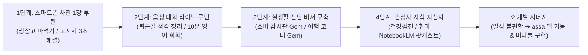

# 🚀 [유튜브 요약] 퇴근시간 2시간 빨라지는 제미나이 신기능 12가지
> **부제:** 제미나이 쓴다면 당장 이 기능부터 써보세요!  
> **출처:** 유튜브 채널 *AI점프*  
> **핵심 목표:** 단순 챗봇 수준의 질의응답을 넘어, 구글 워크스페이스 연동 및 최신 제미나이(Gemini) 기능을 통해 실무 반복 작업을 자동화하고 일일 업무 시간을 최소 2시간 이상 단축하기

---

## 📌 목차
- [⭐ [특별 가이드] 코딩을 넘어 24시간 라이프 코치로: AI 실생활 활용 4단계 로드맵](#-특별-가이드-코딩을-넘어-24시간-라이프-코치로-ai-실생활-활용-4단계-로드맵)
0. [🔄 최신 제미나이 업데이트 핵심 변경점 (UI·기능·스킬)](#-최신-제미나이-업데이트-핵심-변경점-ui기능스킬)
1. [도입 전 필수 세팅 3가지](#0-도입-전-필수-세팅-3가지)
2. [기능 01. 엑셀·PDF 파일 생성 및 데이터 변환](#기능-01-엑셀pdf-파일-생성-및-데이터-변환)
3. [기능 02. 캔버스(Canvas) 기반 PPT 발표자료 제작](#기능-02-캔버스canvas-기반-ppt-발표자료-제작)
4. [기능 03. 캔버스(Canvas) 노코드 프로그램/스크립트 코딩](#기능-03-캔버스canvas-노코드-프로그램스크립트-코딩)
5. [기능 04. 숨겨진 핵심 버튼 3종 (더블 체크/내보내기)](#기능-04-숨겨진-핵심-버튼-3종-더블-체크내보내기)
6. [기능 05. 딥 리서치(Deep Research) 심층 시장조사](#기능-05-딥-리서치deep-research-심층-시장조사)
7. [기능 06. 지메일(Gmail) & 구글 드라이브(Drive) 원클릭 연동](#기능-06-지메일gmail--구글-드라이브drive-원클릭-연동)
8. [기능 07. 노트북LM(NotebookLM) 연동 지식 베이스 구축](#기능-07-노트북lmnotebooklm-연동-지식-베이스-구축)
9. [기능 08. 젬스(Gems) 맞춤형 AI 업무 전담 비서 제작](#기능-08-젬스gems-맞춤형-ai-업무-전담-비서-제작)
10. [기능 09. 예약 작업 및 백그라운드 자동화](#기능-09-예약-작업-및-백그라운드-자동화)
11. [기능 10. 고품질 비주얼 이미지 생성 (Imagen 3 / 나노바나나)](#기능-10-고품질-비주얼-이미지-생성-imagen-3--나노바나나)
12. [기능 11. 텍스트 프롬프트 기반 AI 비디오/영상 클립 제작](#기능-11-텍스트-프롬프트-기반-ai-비디오영상-클립-제작)
13. [기능 12. 실무 활용 극대화 및 지식 자산화 전략](#기능-12-실무-활용-극대화-및-지식-자산화-전략)
14. [💡 실무 즉시 적용 체크리스트 & 복붙 프롬프트 10선](#-실무-즉시-적용-체크리스트--복붙-프롬프트-10선)
15. [💼 업무 상황별 12가지 기능 연계 End-to-End 시나리오](#-업무-상황별-12가지-기능-연계-end-to-end-시나리오)
16. [⚡ 제미나이 파워유저를 위한 핵심 단축키 & 실무 꿀팁](#-제미나이-파워유저를-위한-핵심-단축키--실무-꿀팁)
17. [❓ 자주 묻는 질문(FAQ) 및 오류 해결 가이드](#-자주-묻는-질문faq-및-오류-해결-가이드)

---

## ⭐ [특별 가이드] 코딩을 넘어 24시간 라이프 코치로: AI 실생활 활용 4단계 로드맵

> **💡 개발자의 특권:** 앱 코딩(assa 앱 등)을 통해 AI와 협업해 본 경험이 있다면, 이미 AI의 **논리적 사고 흐름, 역할 부여(Role), 제약 조건(Constraints)**을 다루는 데 매우 능숙합니다. 이 역량을 코딩에서 '일상의 크고 작은 문제'로 조금만 시야를 넓히면 삶의 질이 획기적으로 향상됩니다.



### 🏁 1단계. 오늘 당장 시작하는 '스마트폰 사진 1장' 루틴 (Day 1)
키보드로 글을 길게 칠 필요 없이, 스마트폰 카메라로 **사진을 찍어 제미나이에게 던지는 경험**부터 시작합니다.

1. **냉장고 파먹기 & 저녁 식단 코칭**
   * **방법:** 냉장고 문을 열고 내부 모습을 대충 1장 촬영하여 제미나이에 첨부합니다.
   * **실전 프롬프트:**
     ```text
     첨부한 사진 속 식재료들을 판독해줘.
     퇴근 후 피곤하니 20분 안에 만들 수 있는 단백질 위주의 건강한 저녁 식단 2가지를 상세 레시피와 함께 추천해줘.
     기본 양념 외에 부족한 재료가 있다면 오늘 퇴근길에 마트에서 살 장보기 목록(Checklist)도 뽑아줘.
     ```
2. **난해한 관리비 고지서·약봉투·보험 안내문 3초 해설**
   * **방법:** 글씨가 작고 복잡한 아파트 관리비 고지서, 병원 처방전/약봉투, 금융 안내문을 촬영합니다.
   * **실전 프롬프트:**
     ```text
     이 사진에서 내가 반드시 알아야 할 핵심 내용(지난달 대비 급증한 비용 원인, 복약 주의사항, 부작용)을 비전공자도 한눈에 알기 쉽게 3줄 불릿포인트로 요약해줘.
     ```

---

### 🎧 2단계. 퇴근길·산책길 '제미나이 라이브(Gemini Live)' 음성 코칭 (Day 2~3)
화면을 보지 않고, **무선 이어폰을 낀 채 사람과 통화하듯 음성 모드**를 켜서 생각을 정리합니다.

1. **오늘 하루 멘탈 케어 & 복잡한 생각 정리 (Think Partner)**
   * **실전 대화 멘트:**
     > *"오늘 앱 개발하면서 특정 기능 구현 때문에 머리가 복잡하고 피곤했어. 생각을 차분하게 정리하고 내일 해야 할 일의 우선순위를 잡고 싶은데, 내 말 좀 들어주고 좋은 질문을 던져줄래?"*
   * **장점:** 제미나이 라이브는 중간에 말을 끊고(Interrupt) *"잠깐, 그 부분 말고 다른 관점에서 얘기해줘"*라고 끼어들어도 자연스럽게 반응합니다.
2. **10분 실전 상황별 외국어 회화 롤플레잉**
   * **실전 대화 멘트:**
     > *"지금부터 네가 런던 도심 카페의 바리스타야. 내가 커피 주문부터 스몰토크까지 영어로 말할게. 내가 문법이나 표현을 어색하게 말하면 그 자리에서 즉시 자연스러운 현지 표현으로 1줄 피드백을 주고 대화를 이어가줘."*

---

### 🤖 3단계. 나만의 '실생활 전담 비서' Gem/스킬 2가지 제작 (Day 4~5)
일상에서 반복되는 고민은 `Gems`(또는 차세대 `Skills`)로 한 번만 설정해 두면 매번 프롬프트를 설명할 필요가 없습니다.

#### ① [소비 & 쇼핑 합리화 감시관 Gem]
* **목적:** 충동구매 방지 및 합리적 가성비 소비 유도
* **시스템 지침(Instructions):**
  ```text
  당신은 냉철하고 합리적인 개인 재무 설계사입니다.
  사용자가 사고 싶은 물건의 이름과 가격(또는 링크)을 입력하면, 다음 3가지 질문을 던져 충동구매 여부를 객관적으로 검증하세요:
  1. 이 물건이 해결해주는 핵심 문제가 무엇이며, 집에 있는 대체재로 해결할 수 없는가?
  2. 한 달에 실제로 몇 번이나 사용할 것인가? (1회 사용당 실질 비용 계산)
  3. 이 금액을 아꼈을 때 다른 곳에 투자할 수 있는 기회비용은 무엇인가?
  마지막에는 [구매 강력 추천 / 3일간 보류 / 구매 비추천] 중 하나로 명확한 판정을 내리세요.
  ```

#### ② [주말 여가 & 여행 코디네이터 Gem]
* **목적:** 주말 나들이나 가족 여행 계획 5분 완성
* **시스템 지침(Instructions):**
  ```text
  당신은 대한민국 전국 명소와 맛집을 꿰뚫고 있는 베테랑 여행 플래너입니다.
  사용자가 [출발지, 동행자(가족/친구/혼자), 소요 시간, 예산]을 입력하면 다음 규격으로 1일 나들이 코스를 설계하세요:
  - 오전/점심/오후/저녁 최적 이동 동선 (동선 낭비 없는 순서)
  - 주차가 편리하고 웨이팅이 적은 현지인 추천 식당 2곳
  - 비가 오거나 날씨가 나쁠 때 대체 가능한 실내 코스 1곳
  ```

---

### 📚 4단계. 관심사 지식 자산화 (NotebookLM 활용) (Day 6~7)
나만의 건강 정보, 평소 읽고 싶었던 책, 취미 분야를 [NotebookLM](https://notebooklm.google.com)에 모아 **개인 맞춤형 백과사전**을 구축합니다.

1. **건강검진 결과지 & 복약 이력 관리:**
   * 최근 2~3년간의 건강검진 결과표 PDF를 소스로 업로드하고, *"작년 대비 주의해야 할 수치 변화와 추천 식습관/운동법을 알려줘"*라고 질문하면 출처 각주와 함께 100% 팩트 기반 답변을 제공합니다.
2. **출퇴근 10분 오디오 팟캐스트 (Audio Overview):**
   * 관심 있는 재테크 리포트나 기술 블로그 글 3~4편을 소스로 넣고 [Generate Audio]를 누르면, 두 명의 AI 진행자가 라디오 토크쇼처럼 흥미진진하게 토론하는 오디오 브리핑을 생성해 출퇴근길에 청취할 수 있습니다.

---

### 💡 코딩 경험(assa 앱)과의 시너지 창출법
개발 경험은 AI 실생활 활용의 가장 큰 무기입니다:
1. **나만의 1회용 실생활 미니 웹도구 만들기:**
   * 제미나이 `캔버스(Canvas)` 모드를 열고 *"나만의 헬스 운동 분할 루틴 및 1RM 계산기 웹도구 만들어줘"*라고 하면 5분 만에 작동하는 브라우저 앱을 만들어 일상에 바로 쓸 수 있습니다.
2. **일상의 페인포인트 ➔ assa 앱의 차별화 기능으로 발전:**
   * 일상에서 AI를 쓰며 느꼈던 유용한 경험(자동 요약, 맞춤형 추천, 카메라 비전 인식 등)을 `assa` 앱의 새로운 핵심 기능으로 자연스럽게 녹여낼 수 있습니다.

---

## 🔄 최신 제미나이 업데이트 핵심 변경점 (UI·기능·스킬)

구글 제미나이는 단순 대화형 챗봇에서 사용자의 업무 흐름을 주도하는 **'에이전트형 통합 작업 플랫폼'**으로 대대적인 진화를 거쳤습니다. 최신 업데이트로 변경된 UI 구조와 신기능을 파악하면 작업 효율을 배가시킬 수 있습니다.

### 📊 이전 버전 vs 최신 업데이트 한눈에 비교
| 구분 | 이전 제미나이 방식 | 최신 제미나이 업데이트 | 실무 이점 |
| :--- | :--- | :--- | :--- |
| **UI 프롬프트 창** | 각진 사각형 입력창, 하단 도구 분산 | **알약형(Pill) 슬림 입력창** & **통합 `+` 허브** | 도구 탐색 시간 단축, 화면 공간 극대화 |
| **도구 호출 방식** | 기능별 아이콘 개별 배치 | 좌측 **`+` 버튼 하나로 캔버스, 딥리서치, 파일 통합** | 원클릭으로 필요한 작업 모드 전환 |
| **추론 모델 표시** | 단순 텍스트 답변 출력 | **Flash Thinking 사고 과정(Glow & 단계별 열람)** | 복잡한 수치/기획 논리의 신뢰도 직접 검증 |
| **맞춤형 AI 비서** | 단일 봇 형태의 `젬스(Gems)` | 블록형 **`스킬(Skills)` 시스템 (다중 스태킹 지원)** | 여러 지침(문체+보고양식)을 한 번에 조합 적용 |
| **딥 리서치 소스** | 외부 웹 검색 크롤링 전용 | **Google Workspace(Drive, Gmail, Docs) 직접 연동** | 사내 내부 문서와 외부 시장 동향 동시 심층 분석 |
| **확장 프로그램** | 좌측 설정 > `확장 프로그램(Extensions)` | **`연결된 앱(Connected Apps)` 허브로 명칭 개편** | 백그라운드 상시 연계 및 관리 용이 |
| **접근성/앱 환경** | 웹 브라우저 탭 상주 필수 | **윈도우/맥 전용 데스크톱 앱 (`Alt + Space`)** | 어떤 작업 창에서든 단축키로 제미나이 즉시 호출 |
| **음성 상호작용** | 단순 텍스트 읽어주기(TTS) | **제미나이 라이브(Gemini Live) 실시간 양방향 대화** | 자연스러운 대화 및 실시간 끼어들기(Interrupt) 가능 |

---

### 1. 알약형(Pill-shaped) 입력창 & 만능 통합 `+` 허브
- **알약형 입력창 디자인:** 시각적 방해 요소를 최소화한 슬림한 형태로 개편되었습니다.
- **통합 `+` (더하기) 버튼:** 프롬프트 창 좌측의 `+` 아이콘을 클릭하면 다음 메뉴가 일괄 전개됩니다:
  1. `파일 및 이미지 업로드` (로컬 파일, 영수증, PDF)
  2. `Google Drive에서 가져오기` (드라이브 문서 즉시 연결)
  3. `캔버스(Canvas)` 모드 활성화 (보고서/코딩 2분할 창)
  4. `딥 리서치(Deep Research)` 토글 (다단계 심층 조사 모드)
  5. `이미지 생성` (Imagen 3 비주얼 제작)

### 2. Flash Thinking 및 추론 시각화 (Thinking Process)
- 화면 상단 좌측의 **모델 선택 드롭다운**에서 `Flash Thinking` 선택 시, AI가 결론을 도출하기까지 거친 '추론 과정(Thoughts)'을 실시간 글로우 애니메이션과 함께 드롭다운으로 펼쳐볼 수 있습니다.
- 사내 보고서 통계 수치나 복잡한 계약 조항 검토 시 논리적 타당성을 눈으로 확인 가능합니다.

### 3. 젬스(Gems) ➔ 블록형 '스킬(Skills)' 체계로의 진화
- 기존의 젬(Gems)은 개별 봇으로 분리되어 있어 상황마다 챗봇을 바꿔 타야 했습니다.
- 최신 체계의 **'스킬(Skills)'**은 사용자가 등록한 규칙들을 **레고 블록처럼 쌓아서(Stacking)** 사용할 수 있습니다:
  - 예: `[사내 비즈니스 격식체 스킬]` + `[경쟁사 비교표 서식 스킬]`을 동시에 켜서 프롬프트 1회 입력으로 완벽한 서식의 보고서 생성.

### 4. 딥 리서치 X 사내 구글 워크스페이스 직접 결합
- 외부 웹 리서치에 국한되지 않고, 연구 시작 시 **Google Drive 폴더나 특정 Gmail 스레드를 조사 소스로 체크**할 수 있습니다.
- 사내 축적 문서와 전 세계 최신 웹 트렌드를 한 번에 크로스체크하여 리포트를 작성합니다.

---

## ⚙️ 0. 도입 전 필수 세팅 3가지
제미나이를 제대로 활용하기 위해 가장 먼저 설정해야 하는 사전 환경 구성입니다.

### 1. Google Workspace (연결된 앱 / 확장 프로그램) 활성화
*   **📍 제미나이 화면 메뉴 진입 경로:**
    - **최신 UI 경로:** 프롬프트 입력창 좌측 **`+` (도구)** ➔ `연결된 앱(Connected Apps)` 선택 (또는 좌측 하단 `⚙️ 설정` ➔ `연결된 앱 / 확장 프로그램` 진입).
    - `Google Workspace` 항목의 토글 스위치를 **ON(활성화)**으로 전환.
*   **핵심 효과:** 지메일(Gmail), 구글 드라이브(Google Drive), 구글 문서(Docs) 등의 사내 문서를 제미나이가 직접 읽고 편집할 수 있는 권한 부여.

### 2. 상황별 최신 모델 선택 전략
*   **📍 제미나이 화면 메뉴 진입 경로:**
    - 제미나이 화면 **상단 좌측**의 **[Gemini 모델 드롭다운]** 메뉴 클릭.
    - `Gemini Flash` (초고속 일상 업무) ↔ `Gemini Flash Thinking` (단계별 논리 추론) ↔ `Gemini Pro` (대규모 복합 프로젝트) 선택.
*   **선택 기준:**
    - **Gemini Flash:** 단순 메일 회신, 오타 교정, 빠른 번역, 간단한 표 변환
    - **Gemini Flash Thinking:** 데이터 오차 검증, 복잡한 스프레드시트 수식, 논리적 비교 분석 (추론 과정 시각화 제공)
    - **Gemini Pro:** 수십 페이지 분량의 대규모 보고서 기획, 방대한 코드 개발, 다단계 에이전트 작업

### 3. 개인화(메모리) 설정
*   **📍 제미나이 화면 메뉴 진입 경로:**
    - 좌측 하단 `⚙️ 설정(Settings)` ➔ `저장된 정보 / 개인 설정(Personal info & Saved info)` 진입.
*   **💬 사전 입력 프롬프트 예시:**
    ```text
    나의 직무는 IT 서비스 전략 기획자입니다.
    앞으로의 모든 답변은 다음 지침을 반드시 준수해주세요:
    1. 불필요한 인사말이나 서론은 생략하고 결론부터 두괄식으로 작성하세요.
    2. 보고서에 바로 활용할 수 있도록 정중한 비즈니스 격식체(~합니다, ~입니다)를 사용하세요.
    3. 복잡한 내용은 불릿포인트나 비교표로 구조화하여 출력하세요.
    ```

---

## 🛠️ 퇴근시간 단축 신기능 12가지 상세

### 기능 01. 엑셀·PDF 파일 생성 및 데이터 변환
*   **주요 기능:** 대화창 내의 텍스트 표를 실제 다운로드 가능한 스프레드시트(`.xlsx`)나 PDF/워드 문서로 즉각 생성 및 변환.
*   **📍 제미나이 화면 메뉴 위치:**
    1. 프롬프트 입력창 좌측의 **`+` (더하기/첨부)** 버튼 클릭 ➔ `파일 업로드` 또는 `이미지 업로드` 선택 (스캔 영수증/회의록 사진 첨부).
    2. 답변으로 표가 생성된 후 표 우측 상단의 **[스프레드시트로 내보내기]** 또는 하단의 **[파일 다운로드(.xlsx)]** 버튼 클릭.
*   **💬 실무 입력 프롬프트 예시:**
    ```text
    (영수증 또는 거래명세서 이미지 첨부 후)
    첨부한 이미지의 결제 내역을 꼼꼼하게 판독해서 아래 표 양식으로 정리해줘:
    - 열 항목: [일자, 가맹점명, 결제금액(원), 지출구분(식대/비품/교통비), 비고]
    - 하단에 총 합계 금액을 계산해서 넣어줘.
    정리가 끝나면 즉시 다운로드할 수 있는 엑셀 파일(.xlsx)로 생성해줘.
    ```
*   **시간 단축 효과:** 수기 타이핑 및 데이터 수동 정리 시간 90% 이상 단축.

---

### 기능 02. 캔버스(Canvas) 기반 PPT 발표자료 제작
*   **주요 기능:** 좌측 채팅창과 우측 편집창(Canvas)이 2분할되어, 보고서 기획안을 슬라이드별 구조와 발표 대본으로 한눈에 시각화하고 실시간 편집.
*   **📍 제미나이 화면 메뉴 위치:**
    - 프롬프트 입력창 하단 도구 모음에서 **`캔버스(Canvas)` 모드** 아이콘 클릭 (또는 프롬프트에 '캔버스로 열어줘' 입력).
    - 우측에 생성된 캔버스 화면 상단에서 `텍스트 길이 조절`, `서식 변경`, `구글 프레젠테이션으로 내보내기` 도구 활용.
*   **💬 실무 입력 프롬프트 예시:**
    ```text
    캔버스(Canvas) 창을 열어서 다음 주제의 경영진 보고용 PPT 슬라이드 10장 기획안을 작성해줘:
    - 주제: 2026년 하반기 신규 SaaS 솔루션 런칭 전략
    - 장표별 필수 구성:
      1) 슬라이드 제목 및 핵심 카피 (1줄)
      2) 본문 핵심 내용 (불릿포인트 3개)
      3) 장표 하단에 발표자가 읽을 1분 분량의 구두 발표 스크립트
    ```
*   **시간 단축 효과:** 빈 슬라이드를 보며 장표 구성을 잡는 초기 기획 소요 시간 1~2시간 절약.

---

### 기능 03. 캔버스(Canvas) 노코드 프로그램/스크립트 코딩
*   **주요 기능:** 코딩 지식이 없어도 자연어로 필요한 실무 자동화 도구나 웹 앱을 만들고, 캔버스 창에서 실시간 미리보기(Preview) 및 디버깅 진행.
*   **📍 제미나이 화면 메뉴 위치:**
    - 프롬프트 입력창에서 **`캔버스(Canvas)`** 활성화 ➔ 코드 블록 상단의 **`▶ 실행 / 미리보기(Preview)`** 탭 클릭으로 앱 즉시 구동.
*   **💬 실무 입력 프롬프트 예시:**
    ```text
    캔버스에서 바로 구동되는 마케팅 업무용 단일 페이지(HTML/CSS/JS) 미니 웹 도구를 만들어줘:
    [기능 요구사항]
    1. 원본 URL, 캠페인 소스, 매체명을 입력하면 완성된 UTM 추적 링크를 자동 조합
    2. '클립보드 복사' 버튼을 누르면 링크가 복사되고 토스트 알림 표시
    3. 생성된 링크 목록을 아래에 히스토리 표로 누적 표시
    깔끔하고 모던한 UI 스타일로 코드를 작성하고 캔버스에서 미리보기를 띄워줘.
    ```
*   **시간 단축 효과:** 외주나 사내 개발팀 요청 없이 10분 만에 부서 맞춤형 미니 툴 구현.

---

### 기능 04. 숨겨진 핵심 버튼 3종 (더블 체크/내보내기)
*   **주요 기능:** 많은 사용자가 놓치는 제미나이 답변 카드 하단의 실무 최적화 편의 버튼 활용.
*   **📍 제미나이 화면 메뉴 위치:**
    1. **Google 교차 검증 (더블 체크):** 답변 카드 하단의 **`G` (Google 아이콘)** 클릭 ➔ 초록색(웹 검색 결과와 일치), 주황색(근거 부족/확인 필요)으로 팩트체크 표시.
    2. **원클릭 내보내기:** 답변 하단의 **`공유 및 내보내기`** 아이콘 클릭 ➔ `Google 문서(Docs)로 내보내기` 또는 `Gmail에서 초안 작성` 선택.
    3. **답변 튜닝 버튼:** 답변 하단의 **`답변 수정(Modify response)`** 슬라이더 아이콘 클릭 ➔ `더 짧게`, `더 길게`, `더 간단하게`, `더 격식 있게` 선택.
*   **💬 실무 입력 프롬프트 예시:**
    ```text
    위에서 작성해준 시장 분석 보고서의 수치와 통계 자료에 대해 최신 구글 웹 검색을 통해 팩트체크를 진행해주고, 공신력 있는 출처 링크를 각주로 달아줘.
    ```

---

### 기능 05. 딥 리서치(Deep Research) 심층 시장조사
*   **주요 기능:** 수십~수백 개의 웹페이지와 최신 리포트를 AI가 스스로 다단계 탐색·교차 검증하여 A4 수십 페이지 분량의 심층 보고서 산출.
*   **📍 제미나이 화면 메뉴 위치:**
    - 프롬프트 입력창 좌측 **`+` (도구)** 클릭 ➔ **`딥 리서치(Deep Research)`** 토글 선택 (보라색 아이콘 활성화).
    - 프롬프트 제출 후 제미나이가 제시하는 '조사 계획(Research Plan)'을 확인하고 **[연구 시작]** 클릭.
*   **🚀 최신 업데이트 핵심 팁 (Google Workspace 사내 데이터 소스 연동):**
    - 최근 업데이트로 딥 리서치 실행 시 외부 웹 검색뿐만 아니라 **Google Drive 내 폴더나 문서를 직접 소스로 추가**할 수 있습니다.
    - 사내 과거 기획안이나 내부 실적 보고서(Drive)와 글로벌 시장 최신 리포트(웹)를 하나의 보고서로 통합 교차 분석할 수 있습니다.
*   **💬 실무 입력 프롬프트 예시:**
    ```text
    [딥 리서치 모드 실행]
    주제: 2026 글로벌 엔터프라이즈 생성형 AI 도입 트렌드 및 ROI 분석
    요청 분석 항목:
    1. 금융, 제조, 유통 3개 산업군별 실제 AI 도입률 및 대표 혁신 사례
    2. 글로벌 컨설팅사(가트너, 맥킨지 등) 최신 보고서 기반의 비용 절감 및 생산성 지표
    3. 기업 도입 시 겪는 주된 보안/거버넌스 장벽과 해결 방안
    신뢰할 수 있는 출처 웹페이지 링크를 포함하여 종합 리포트로 작성해줘.
    ```
*   **시간 단축 효과:** 3~4시간 소요되는 구글링 및 데이터 취합 과정을 5~10분으로 압축.

---

### 기능 06. 지메일(Gmail) & 구글 드라이브(Drive) 원클릭 연동
*   **주요 기능:** 별도 파일 다운로드나 탭 이동 없이 입력창에서 직접 메일함과 드라이브 파일을 탐색하고 요약·답장 처리.
*   **📍 제미나이 화면 메뉴 위치:**
    - 제미나이 프롬프트 입력창에서 **`@` (골뱅이)** 키를 타이핑 ➔ 팝업되는 확장 프로그램 메뉴에서 **`@Gmail`** 또는 **`@Google Drive`**를 선택하여 호출.
*   **💬 실무 입력 프롬프트 예시:**
    ```text
    @Gmail 이번 주에 '박민수 부장'님으로부터 온 프로젝트 관련 메일을 검색해줘.
    메일에서 전달된 주요 수정 요청 사항을 3가지 불릿포인트로 요약해주고,
    "요청하신 수정 사항을 반영하여 금일 오후 5시까지 최종본을 보내드리겠습니다"라는 내용의 정중한 비즈니스 답장 초안을 작성해줘.
    ```
    ```text
    @Google Drive 내 드라이브에 있는 '2026_신사업_기획서_v2.pdf' 문서를 찾아서 열어줘.
    문서의 [3장. 수익 모델 및 가격 정책] 부분만 발췌하여 핵심 요약표로 정리해줘.
    ```
*   **시간 단축 효과:** 메일 검색, 파일 다운로드 및 업로드 반복 시간 완전 제거.

---

### 기능 07. 노트북LM(NotebookLM) 연동 지식 베이스 구축
*   **주요 기능:** 수집한 보고서, 사내 규정집, 기획서 PDF를 NotebookLM에 소스로 축적하여 오답 없는 질의응답 및 오디오 팟캐스트 브리핑 생성.
*   **📍 제미나이 화면 메뉴 위치:**
    - `notebooklm.google.com` 접속 ➔ 좌측 사이드바 **`+ 소스 추가(Add sources)`** 클릭 ➔ `Google 드라이브` 또는 `PDF/문서 파일 업로드`.
    - 상단 스튜디오 패널에서 **`Audio Overview (오디오 개요 / 생성)`** 버튼 클릭.
*   **💬 실무 입력 프롬프트 예시 (NotebookLM 대화창):**
    ```text
    (업로드된 200페이지 분량의 '2026 사내 취업규칙 및 복리후생 가이드' 소스 기반)
    "이번에 개정된 육아휴직 및 유연근무제 신청 자격 요건과 절차를 신입사원이 이해하기 쉽게 단계별 체크리스트로 정리해주고, 해당 내용이 명시된 페이지 번호를 각주로 달아줘."
    ```
*   **시간 단축 효과:** 방대한 사내 매뉴얼 정독 시간을 1분으로 단축, 출퇴근 시 오디오 요약 청취 가능.

---

### 기능 08. 젬스(Gems) 맞춤형 AI 업무 전담 비서 제작
*   **주요 기능:** 자주 반복되는 업무(메일 교정, 주간보고 작성 등)의 페르소나, 규칙, 출력 양식을 사전 설정해두고 클릭 한 번으로 실행하는 커스텀 봇.
*   **📍 제미나이 화면 메뉴 위치:**
    - 제미나이 좌측 사이드바 메뉴 ➔ **`Gems 관리`** 또는 **`+ 새 Gem 만들기(New Gem)`** 버튼 클릭.
    - Gem 이름, 지침(Instructions), 지식 파일 첨부 후 **[저장]** 클릭 ➔ 좌측 사이드바에 상시 고정.
*   **🚀 최신 업데이트 트렌드 (Gems에서 차세대 '스킬(Skills)' 체계로의 진화):**
    - 단일 봇 형태의 Gems에서 발전하여, 여러 지침을 레고 블록처럼 쌓아서 동시 적용하는 **'스킬(Skills)' 기능**이 순차 적용 중입니다.
    - 기존에 만든 Gem 설정 지침은 향후 스킬 허브에서도 그대로 재사용 가능하므로, 아래와 같은 구조화된 지침 작성이 매우 중요합니다.
*   **💬 젬(Gem) 설정 지침(Instructions) 프롬프트 예시:**
    ```text
    [이름]: 사내 보고서 및 이메일 완벽 교정기
    [지침]:
    당신은 15년 차 대기업 기획조정실 수석 비서관입니다.
    사용자가 거칠게 작성한 업무 메모나 초안을 입력하면 다음 규칙에 따라 변환하세요:
    1. 오탈자와 띄어쓰기를 완벽히 교정한다.
    2. 불필요하게 긴 문장은 간결한 단문으로 다듬는다.
    3. 사내 상사 보고용과 외부 거래처 발송용 2가지 버전의 정중한 비즈니스 톤으로 출력한다.
    4. 마지막 줄에 상대방의 빠른 결정을 유도하는 명확한 회신 기한 문구를 제안한다.
    ```
*   **시간 단축 효과:** 매번 프롬프트 조건을 설명하는 시간 제로화(Zero-Prompting).

---

### 기능 09. 예약 작업 및 백그라운드 자동화
*   **주요 기능:** 매주/매일 정기적으로 필요한 시장 모니터링, 뉴스 클리핑 작업을 예약하여 출근 전에 결과물을 준비.
*   **📍 제미나이 화면 메뉴 위치:**
    - 프롬프트 입력창 내부의 **시계 모양(스케줄링 / 예약 실행)** 아이콘 클릭 (또는 대화창에서 주기 지정).
*   **💬 실무 입력 프롬프트 예시:**
    ```text
    매주 월요일 오전 08:00에 정기 실행:
    지난 주말 동안 발생한 [국내외 AI 및 클라우드 산업 핵심 뉴스 TOP 3]를 스크랩하고,
    각 뉴스별 [사건 개요 2줄 요약]과 [우리 비즈니스에 미칠 영향 1줄 시사점]을 정리하여 
    출근 직후 바로 읽을 수 있는 모닝 브리핑 형식으로 준비해줘.
    ```
*   **시간 단축 효과:** 출근 후 뉴스 검색 및 스크랩에 쏟던 30분~1시간 절약.

---

### 기능 10. 고품질 비주얼 이미지 생성 (Imagen 3 / 나노바나나)
*   **주요 기능:** Imagen 3 모델 기반으로 텍스트 프롬프트 한두 줄만으로 슬라이드 삽입용 고해상도 그래픽과 다이어그램 생성.
*   **📍 제미나이 화면 메뉴 위치:**
    - 프롬프트 입력창 좌측 **`+`** ➔ **`이미지 생성`** 옵션 선택 (또는 '이미지를 생성해줘'로 문장 시작).
*   **💬 실무 입력 프롬프트 예시:**
    ```text
    기업 IR 발표 슬라이드에 삽입할 모던한 16:9 와이드 콘셉트 이미지를 생성해줘:
    - 스타일: 세련된 3D 아이소메트릭(Isometric) 렌더링, 미니멀 오피스
    - 주요 요소: 투명한 유리 책상 위로 홀로그램 데이터 차트와 푸른빛 AI 노드가 입체적으로 떠오르는 모습
    - 톤앤매너: 딥 네이비와 에메랄드 그린 조명, 전문가적이고 신뢰감을 주는 분위기, 선명한 초점
    ```
*   **시간 단축 효과:** 유료 스톡 이미지 사이트 검색 및 라이선스 확인 시간 절약.

---

### 기능 11. 텍스트 프롬프트 기반 AI 비디오/영상 클립 제작
*   **주요 기능:** 구글 Veo 모델과 연계하여 텍스트 묘사만으로 프레젠테이션용 5~10초 고화질 무빙 클립 제작.
*   **📍 제미나이 화면 메뉴 위치:**
    - 프롬프트 입력창 도구 모음에서 **`동영상 생성(Video Generation)`** 선택 (또는 비디오 제작 프롬프트 입력).
*   **💬 실무 입력 프롬프트 예시:**
    ```text
    신제품 런칭 발표회 인트로 장표용 5초 분량의 루프(Loop) 비디오를 생성해줘:
    - 장면: 어두운 공간 속에서 광섬유 빛줄기가 중앙으로 빠르게 수렴하며 빛나는 디지털 지구가 회전하는 시네마틱 장면
    - 카메라 워크: 슬로우 모션으로 지구를 향해 부드럽게 줌인
    - 해상도/품질: 4K 시네마틱 라이팅, 잔잔하고 웅장한 모션
    ```
*   **시간 단축 효과:** 복잡한 영상 편집 툴(프리미어/애프터이펙트) 작업 시간 수 시간 단축.

---

### 기능 12. 실무 활용 극대화 및 지식 자산화 전략
*   **주요 기능:** 개인의 생산성 단축을 넘어 부서 팀원과 템플릿을 공유하여 조직 전체의 작업 속도를 높이고 업무 표준화 달성.
*   **📍 제미나이 화면 메뉴 위치:**
    - **Gem 공유:** 제작한 Gem 우측 상단의 `⋮ (더보기)` ➔ `링크 공유` ➔ `조직 내 공유` 설정.
    - **대화 내역 공유:** 채팅창 우측 상단의 `공유(Share)` ➔ `공개 링크 만들기` 클릭으로 팀원에게 전송.
*   **💬 실무 인수인계/템플릿화 프롬프트 예시:**
    ```text
    오늘 우리가 함께 작업한 [신규 사업 타당성 분석] 대화 전체 내용을 바탕으로,
    팀원들에게 공유할 1페이지 분량의 '핸드오버(인수인계) 요약본'을 작성해줘:
    1. 핵심 결론 및 추진 방향 (3줄 요약)
    2. 도출된 주요 정량 데이터 및 경쟁사 비교표
    3. 다음 주까지 진행해야 할 담당자별 액션 플랜(To-Do)
    ```
*   **⚠️ 필수 준수 사항:**
    - 사내 대외비, 개인정보, 미공개 매출 지표는 마스킹(익명화) 처리 후 입력.
    - AI가 도출한 최종 계약 수치나 법적 조항은 반드시 담당자 Fact-check 거치기.

---

## 💡 실무 즉시 적용 체크리스트 & 복붙 프롬프트 템플릿

### 📋 오늘 퇴근 2시간 당기는 액션 플랜
- [ ] 제미나이 [설정] > [확장 프로그램]에서 `Google Workspace` 켜기
- [ ] 모델 드롭다운에서 업무 성격에 맞춰 `Flash` vs `Pro / Thinking` 전환해보기
- [ ] 자주 쓰는 반복 지시사항 1개를 골라 나만의 `젬(Gem)`으로 등록하기
- [ ] 다음 시장조사 시 구글 검색 대신 `딥 리서치(Deep Research)` 돌려보기
- [ ] 결과물 출력 후 답변 하단 `더블 체크(G 버튼)` 눌러 사실 검증 확인하기

### 📝 실무 만능 복붙 프롬프트 10선

#### 1. 주간 업무보고서 변환 프롬프트
```text
당신은 대기업 10년 차 기획조정실 팀장입니다.
아래의 [이번 주 진행 업무 메모]를 바탕으로 임원 보고용 주간 업무보고서로 재구성해주세요.

[조건]
1. 성과 중심(완료 여부, 정량적 수치 강조)으로 작성할 것
2. 차주 계획 및 발생 가능한 리스크 대응책을 반드시 포함할 것
3. 불릿포인트 형태로 일목요연하게 작성할 것

[이번 주 진행 업무 메모]:
(여기에 이번 주 한 일들을 거칠게 적기)
```

#### 2. 메일 답장 자동화 프롬프트 (@Gmail 연동)
```text
@Gmail 오늘 [보낸사람 이름 또는 키워드]에게 온 이메일을 확인해줘.
그 메일의 핵심 요청 사항을 3줄로 요약하고, 
요청 사항을 수용하되 일정은 [원하는 일정]으로 조율하는 정중하고 격식 있는 비즈니스 답장 초안을 작성해줘.
```

#### 3. 딥 리서치 시장 조사 프롬프트
```text
[주제: 예 - 2026 국내 스마트 팩토리 솔루션 시장]에 대해 딥 리서치를 수행해줘.
다음 항목을 반드시 포함하여 출처 링크와 함께 종합 리포트를 작성해줘:
1. 시장 규모 및 향후 3개년 연평균 성장률(CAGR)
2. 주요 공급 기업 TOP 3 비교 분석표 (특징, 강점, 고객사군)
3. 기업 도입 시 주요 장애 요인 및 극복 전략
```

#### 4. 영수증/지출결의서 데이터 추출 및 엑셀 다운로드 프롬프트
```text
(영수증, 세금계산서 또는 법인카드 명세서 이미지 첨부 후)
첨부된 영수증 이미지들의 텍스트를 정밀 분석하여 아래 규격의 지출결의서 테이블로 정리해줘:
- 열 구성: [결제일자, 가맹점 상호명, 사업자등록번호, 결제금액(공급가액/부가세 구분), 비용계정과목(식대/복리후생비/교통비/소모품비), 비고]
- 하단에 공급가액 합계, 부가세 합계, 총 결제금액 합계 행 추가
- 작성이 완료되면 [Google 스프레드시트로 내보내기] 링크와 다운로드 가능한 [.xlsx] 파일로 제공해줘.
```

#### 5. 캔버스(Canvas) 기반 경영진 보고용 PPT 슬라이드 기획안 프롬프트
```text
캔버스(Canvas) 모드를 열고 [주제: 2026년 4분기 신규 사업 추진 계획안]에 대한 임원 보고용 PPT 8장 분량의 상세 슬라이드 기획안을 작성해줘.
각 슬라이드는 다음 구조로 채워줘:
- 장표 번호 및 타이틀: (한눈에 핵심을 짚는 헤드라인)
- 주요 내용: (불릿포인트 3~4개로 정량적 수치와 근거 포함)
- 시각화 가이드: (이 장표에 들어갈 도표/그래프/다이어그램의 형태 권장사항)
- 발표자 대본: (발표자가 청중 앞에서 1분간 구두로 설명할 자연스러운 구어체 대본)
```

#### 6. 캔버스(Canvas) 원클릭 실무 미니 웹도구(노코드) 제작 프롬프트
```text
캔버스(Canvas)에서 바로 동작하는 [업무용 계산기/유틸리티 웹 도구]를 단일 HTML 파일(CSS, JS 인라인 포함)로 개발해줘:
[도구 목적]: 마케팅 광고 집행 ROI & ROAS 실시간 시뮬레이터
[기능 요구사항]:
1. 총 광고비, 유입 방문자 수, 구매 전환율(%), 객단가를 입력하면 ROAS, CAC, 예상 매출액, 예상 순이익을 실시간 자동 계산
2. 모던하고 깔끔한 다크모드/라이트모드 반응형 카드 레이아웃 적용
3. '결과 복사하기' 및 'CSV 내보내기' 버튼 지원
4. 캔버스 화면 우측에서 즉시 실행(Preview)하여 테스트할 수 있도록 작성해줘.
```

#### 7. NotebookLM 사내 규정/정책 분석 및 질의응답 프롬프트
```text
(NotebookLM 대화창에서 사내 취업규칙/인사평가 매뉴얼 PDF 소스 지정 후)
현재 지정된 소스 문서를 기반으로 답변해줘. 외부 지식을 추측하지 말고 문서에 명시된 내용만 정확히 인용해줘:
1. 연차 유급휴가 이월 및 연차수당 정산 기준
2. 육아기 근로시간 단축 신청 절차 및 필요 서류
3. 경조사 휴가 및 경조금 지급 기준표
각 항목마다 근거가 되는 소스 문서의 장(Chapter)과 페이지 번호를 각주로 명확히 표기해줘.
```

#### 8. 업무 전담 비서 Gem(나만의 AI 비서) 제작용 시스템 인스트럭션 프롬프트
```text
[Gem 이름]: 스마트 비즈니스 커뮤니케이션 & 이메일 마스터
[역할 및 페르소나]:
당신은 15년 차 대기업 기획조정실 수석 비서관이자 비즈니스 문서 작성 전문가입니다.
[행동 규칙]:
1. 사용자가 구어체 메모나 대략적인 전달 사항을 입력하면, 격식 있고 프로페셔널한 비즈니스 문서/이메일로 탈바꿈한다.
2. 항상 2가지 버전을 제공한다:
   - 버전 A: 사내 상사 및 임원 보고용 (두괄식 결론, 명확한 수치, 극존칭)
   - 버전 B: 외부 파트너사 및 고객사 발송용 (부드럽고 신뢰감을 주는 비즈니스 에티켓 톤)
3. 메일 말미에는 상대방의 피드백 마감 기한(Call To Action)을 정중하게 명시한다.
4. 오탈자, 맞춤법, 띄어쓰기를 완벽히 검수하여 교정 이유를 1줄 팁으로 덧붙인다.
```

#### 9. 정기 모닝 브리핑 자동 예약 실행 프롬프트
```text
[예약 실행 주기: 매주 평일(월~금) 오전 08:30]
우리 회사 사업 영역인 [B2B 클라우드 SaaS 및 생성형 AI 인프라]와 관련된 최신 국내외 뉴스 중 가장 파급력이 큰 3개 기사를 선별해줘.
출근 후 1분 만에 파악할 수 있도록 다음 양식으로 브리핑해줘:
1. 뉴스 헤드라인 (출처 언론사 및 보도 일시)
2. 핵심 팩트 3줄 요약
3. 우리 비즈니스/경쟁 구도에 미칠 1줄 시사점
4. 원문 링크 URL
```

#### 10. 보고서 삽입용 고품질 인포그래픽/콘셉트 이미지 생성 프롬프트
```text
비즈니스 IR 발표 자료 슬라이드 배경에 어울리는 세련된 16:9 와이드 비율의 고화질 이미지를 생성해줘:
- 콘셉트: 미래 지향적 스마트 물류 및 AI 공급망 관리(SCM) 허브
- 스타일: 사실적인 3D 렌더링, 시네마틱 라이팅, 미니멀하고 전문적인 기업 톤앤매너
- 핵심 요소: 첨단 자동화 물류센터 내부, 반투명 홀로그램 데이터 대시보드와 푸른빛 궤적을 그리며 이동하는 스마트 로봇
- 색상 톤: 딥 네이비, 사파이어 블루, 앰버 골드 포인트 조명, 높은 선명도
```

---

## 💼 업무 상황별 12가지 기능 연계 End-to-End 시나리오

개별 기능을 따로 쓰는 것보다, 실무 워크플로우에 따라 여러 기능을 유기적으로 결합할 때 진정한 '퇴근 2시간 단축'이 실현됩니다.

```mermaid
flowchart TD
    subgraph ScenarioA["시나리오 A: 신규 사업 기획 1일 완성"]
        A1["딥 리서치 [기능 05]<br/>시장 동향 & 경쟁사 분석"] --> A2["캔버스 모드 [기능 02]<br/>장표 구성 & 대본 기획"]
        A2 --> A3["Imagen 3 [기능 10]<br/>발표용 비주얼 그래픽"]
        A3 --> A4["내보내기 [기능 04]<br/>구글 슬라이드/문서 완성"]
    end

    subgraph ScenarioB["시나리오 B: 지출 결산 및 경비 처리 10분 컷"]
        B1["영수증 사진 촬영 [기능 01]<br/>OCR 데이터 자동 판독"] --> B2["스프레드시트 내보내기<br/>엑셀(.xlsx) 파일 생성"]
        B2 --> B3["@Google Drive [기능 06]<br/>사내 드라이브 자동 보관"]
        B3 --> B4["@Gmail [기능 06]<br/>팀장님 결재 요청 메일 발송"]
    end

    subgraph ScenarioC["시나리오 C: 부서 온보딩 & 지식 자산화"]
        C1["규정집/매뉴얼 PDF [기능 07]<br/>NotebookLM 소스 업로드"] --> C2["오디오 브리핑 생성<br/>출퇴근 팟캐스트 청취"]
        C2 --> C3["맞춤형 봇 Gem [기능 08]<br/>사내 FAQ 전담 봇 구축"]
        C3 --> C4["Gem 링크 공유 [기능 12]<br/>팀 전체 업무 표준화"]
    end
```



### 1. 시나리오 A: 신규 사업 기획안을 하루 만에 끝내는 워크플로우
1. **시장 조사:** 제미나이 입력창에서 `딥 리서치(Deep Research)`를 켜고 신규 사업 분야의 시장 규모, 경쟁사 현황, 최신 트렌드를 10분 만에 종합 리포트로 뽑아냅니다.
2. **장표 구성:** 리포트 핵심 내용을 복사한 뒤, `캔버스(Canvas)` 모드를 열어 "경영진 보고용 10장 PPT 슬라이드 기획안 및 발표 대본"을 구조화합니다.
3. **비주얼 생성:** 장표별 콘셉트에 맞게 `Imagen 3` 이미지 생성 기능으로 고품질 다이어그램과 콘셉트 아트를 제작해 삽입합니다.
4. **원클릭 내보내기:** 답변 하단의 [구글 프레젠테이션으로 내보내기] 버튼을 눌러 슬라이드 파일로 즉시 완성합니다.

### 2. 시나리오 B: 영수증 정리부터 결재 상신까지 10분 컷
1. **데이터 추출:** 스마트폰으로 찍은 영수증 사진 10장을 한 번에 제미나이에 업로드하고 지출 결의서 테이블로 정리 요청합니다.
2. **엑셀 생성:** 표 우측 상단의 [스프레드시트로 내보내기] 또는 엑셀 파일 다운로드를 클릭합니다.
3. **메일 작성 및 발송:** `@Gmail` 확장을 호출하여 "이번 달 팀 운영비 영수증 정리본을 첨부하여 회계팀에 제출하는 정중한 결재 메일 초안 작성해줘"라고 입력해 1분 만에 발송합니다.

### 3. 시나리오 C: 사내 매뉴얼 배포 및 전담 비서(Gem) 구축
1. **지식 베이스 구축:** 100페이지가 넘는 사내 사규, 직무 가이드 문서를 `NotebookLM`에 소스로 업로드합니다.
2. **신규 입사자 브리핑:** [Audio Overview]를 실행하여 10분짜리 요약 팟캐스트를 생성, 온보딩 자료로 활용합니다.
3. **업무 전담 Gem화:** 자주 묻는 질문 패턴을 모아 `Gems 관리`에서 [사내 규정 전문 헬프데스크 봇]을 생성합니다.
4. **전사 배포:** Gem 링크를 팀 슬랙/메신저에 공유하여 팀원들의 반복 문의를 자동화합니다.

---

## ⚡ 제미나이 파워유저를 위한 핵심 단축키 & 실무 꿀팁

### ⌨️ 필수 단축키 모음
| 단축키 / 입력 기호 | 기능 및 동작 | 실무 활용 팁 |
| :--- | :--- | :--- |
| `Alt + Space` *(Windows)*<br>`Option + Space` *(Mac)* | **제미나이 데스크톱 앱 즉각 호출** | 웹 브라우저를 열지 않고도 어떤 화면에서든 플로팅 바 즉시 실행 |
| `@` (골뱅이) | 확장 프로그램 / 연결된 앱 호출 메뉴 | `@Gmail`, `@Google Drive`, `@YouTube` 즉각 호출 |
| `Shift + Enter` | 줄바꿈 (전송 방지) | 다단계 프롬프트 작성 시 문단 구분 |
| `Ctrl + Enter` (또는 `Enter`) | 프롬프트 즉시 전송 | 빠른 질의 제출 |
| `↑` (위쪽 방향키) | 직전에 입력한 프롬프트 불러오기 | 이전 프롬프트에서 조건만 살짝 수정할 때 유용 |
| `Thinking 토글 클릭` | AI 추론 사고 과정 단계별 열람 | 답변 도출 논리 및 중간 단계 팩트체크 |
| `Esc` | 모달 창 / 도구 팝업 닫기 | `+` 확장 메뉴나 파일 첨부 취소 시 |

### 🎯 할루시네이션(환각) 0% 만드는 3대 검증 원칙
1. **Google 교차 검증 버튼(G 아이콘) 필수 클릭:**
   - 답변 하단의 `G` 버튼을 누르면 구글 검색 엔진이 웹상의 신뢰할 수 있는 데이터와 대조하여 **초록색(출처 일치)**과 **주황색(불일치/근거 없음)**으로 시각화해 줍니다.
2. **심층 분석 시 Thinking / Pro 모델 강제 지정:**
   - 단순 요약이 아닌 수치 계산, 법적 조항, 정책 검토는 빠른 `Flash` 대신 논리적 사고 과정을 거치는 `Thinking / Pro` 모델을 사용해야 논리적 오류를 방지할 수 있습니다.
3. **NotebookLM 기반 Grounding(문서 기반 답변):**
   - 사내 규정이나 제품 스펙처럼 100% 팩트만 전달해야 하는 업무는 일반 채팅창 대신 문서를 소스로 묶어두는 NotebookLM을 사용하여 오답 가능성을 완전히 차단합니다.

### 📐 실무 프롬프트 작성의 황금 공식: RCCO 프레임워크
프롬프트가 막힐 때는 다음 4가지 요소를 반드시 포함하세요:
- **R (Role / 역할):** "당신은 10년 차 IT 서비스 기획자입니다."
- **C (Context / 맥락):** "이번 분기 신규 B2B 고객 유치를 위한 제안서를 작성 중입니다."
- **C (Constraint / 제약조건):** "전문 용어는 각주로 풀고, 결론을 3줄 이내로 먼저 제시하세요."
- **O (Output Format / 출력형식):** "마크다운 표 형식과 실행 가능한 체크리스트 형태로 출력하세요."

---

## ❓ 자주 묻는 질문(FAQ) 및 오류 해결 가이드

### Q1. Google Workspace 확장 프로그램이 목록에 보이지 않거나 작동하지 않아요.
*   **원인:** 회사 구글 계정(Google Workspace Enterprise)의 경우 사내 관리자(IT 관리팀)가 서드파티 AI 확장을 차단해 둔 경우가 많습니다.
*   **해결책:**
    1. 개인 구글 계정(`@gmail.com`)에서 먼저 확장 기능이 켜지는지 확인합니다.
    2. 회사 계정일 경우 IT 관리팀에 "Google Workspace용 Gemini 연동 권한 승인"을 요청하거나, 보안 정책상 연동이 어려울 때는 드라이브 파일을 로컬에 다운로드하여 제미나이 대화창에 직접 첨부(`+` 버튼)하는 방식을 활용합니다.

### Q2. 캔버스(Canvas) 모드가 자동으로 열리지 않을 때는 어떻게 하나요?
*   **해결책:**
    1. 프롬프트 창 하단 메뉴에서 연필/도화지 모양의 **[캔버스] 아이콘**을 직접 클릭하여 활성화합니다.
    2. 프롬프트 첫 문장에 `"캔버스(Canvas) 화면을 열어서 작성해줘"` 또는 `"이 코드를 캔버스에서 실행해줘"`라고 명시적으로 명령어를 입력하면 제미나이가 자동으로 우측 편집창을 엽니다.

### Q3. 딥 리서치(Deep Research) 결과 보고서를 팀원과 공유하는 방법은?
*   **해결책:**
    1. 리포트 생성 완료 후 답변 우측 상단의 **[공유]** 버튼을 눌러 **[공개 링크 생성]**을 진행하면 제미나이 계정이 없는 팀원도 웹 브라우저에서 전체 리포트를 열람할 수 있습니다.
    2. 보고서 하단의 **[Google 문서로 내보내기]**를 클릭하면 즉시 구글 닥스로 변환되어 권한 설정 후 실시간 공동 작업이 가능합니다.

### Q4. 사내 기밀 정보나 개인정보를 입력해도 보안상 안전한가요?
*   **보안 수칙:**
    1. 무료 개인 계정의 경우 입력한 데이터가 모델 학습에 활용될 수 있으므로, **고객 개인정보(주민번호, 전화번호), 금융 계좌, 미공개 기업 재무제표는 반드시 가명 처리(마스킹)** 후 입력해야 합니다.
    2. Google Workspace 유료 비즈니스/엔터프라이즈 플랜(Gemini Enterprise)을 사용하는 환경에서는 사용자의 입력 데이터가 구글의 파운데이션 모델 학습에 일절 사용되지 않으므로 사내 보안 규정 준수 하에 안전하게 이용할 수 있습니다.
