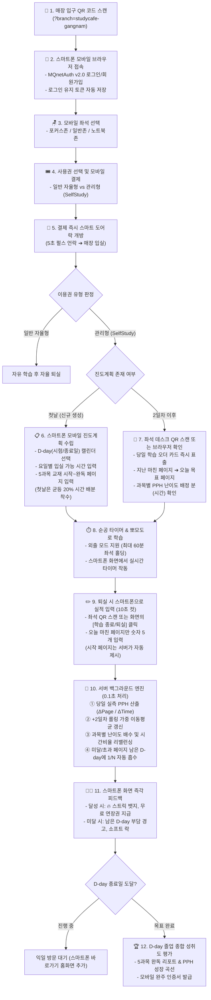

# 📘 셀프스터디를 포함하는 스터디카페 구현계획서 (SaaS Template & Mobile Web QR 기반)
> **문서 버전:** v2.0.0 (2026-10-04 실전 현장 운영 및 SaaS 표준 규격)  
> **시스템 명칭:** MQnet StudyCafe × SelfStudy 통합 관리형 학습 OS  
> **아키텍처 표준:** MQnet SaaS Application Development Guide (`NEW_APP_DEVELOPMENT_GUIDE.md`) 준수  
> **운영 통신 정책:** **문자(SMS)·카카오톡 알림톡 완전 배제 (비용 0원)**, 스마트폰 모바일 브라우저(입구/좌석 데스크 QR 스캔) 직접 서버 접속 방식  
> **적용 대상:** 무인 스터디카페, 관리형 독서실, 자습형 입시/자격증 학원

---

## 📑 목차
1. [시스템 비전 및 핵심 가치 (Zero-Message, Zero-Cost)](#1-시스템-비전-및-핵심-가치-zero-message-zero-cost)
2. [MQnet SaaS 템플릿 아키텍처 및 기술 스택 규격](#2-mqnet-saas-템플릿-아키텍처-및-기술-스택-규격)
3. [전체 사용자 여정 및 스마트폰 QR 라이프사이클 흐름도](#3-전체-사용자-여정-및-스마트폰-qr-라이프사이클-흐름도)
4. [스마트폰 모바일 웹 QR 기반 SelfStudy 핵심 인터랙션 명세](#4-스마트폰-모바일-웹-qr-기반-selfstudy-핵심-인터랙션-명세)
5. [현장 운영을 위한 6대 실전 필수 안전장치](#5-현장-운영을-위한-6대-실전-필수-안전장치)
6. [수학적 연산 엔진 공식 (PPH & Rebalancing)](#6-수학적-연산-엔진-공식-pph--rebalancing)
7. [모바일 웹 반응형 UI/UX 화면 설계](#7-모바일-웹-반응형-uiux-화면-설계)
8. [데이터베이스 스키마 설계 (SQLAlchemy ORM)](#8-데이터베이스-스키마-설계-sqlalchemy-orm)
9. [백엔드 API 엔드포인트 명세](#9-백엔드-api-엔드포인트-명세)
10. [점주 관제 대시보드 및 학부모 안심 웹 포털 (0원 비용)](#10-점주-관제-대시보드-및-학부모-안심-웹-포털-0원-비용)
11. [단계별 구축 및 롤아웃 일정표](#11-단계별-구축-및-롤아웃-일정표)

---

## 1. 시스템 비전 및 핵심 가치 (Zero-Message, Zero-Cost)

기존 무인 스터디카페의 고질적인 한계와 비효율을 완벽히 혁신합니다:

1. **외부 메시징(SMS·카톡) 전면 제거 ➔ 통신 비용 0원 & 통신사 심사 불필요**:
   - 알림톡 건당 비용(15~20원), LMS/SMS 장문 문자 비용(30~50원), 카카오 발신자 번호 승인 절차를 전면 제거.
   - 모든 사용자 인터랙션(진도계획표 수립, 당일 학습 오더 수신, 퇴실 시 달성 페이지 입력, 학부모 실시간 확인)은 **스마트폰 기본 카메라로 매장 입구 및 좌석 데스크 QR 코드를 스캔하여 모바일 웹에 즉시 접속**하는 초경량 방식으로 작동합니다.
2. **MQnet SaaS 템플릿 표준 규격 100% 준수**:
   - 프론트엔드 빌드 도구(`npm build`, `webpack`) 없는 순수 **Vanilla JS/CSS 번들리스 모듈 구조**.
   - 브라우저 정적 캐시 고착을 원천 차단하는 `NoCacheStaticFiles` 및 캐시 버스팅(`?v=2.0`).
   - 단일 게이트웨이(Port 8000/9000)를 통한 통합 인증(`MQnetAuth v2.0`) 및 멀티테넌트 API 자동 라우팅.
3. **PPH 기반 전자동 자기주도학습 관리형 OS**:
   - 단순 공간 임대(월 12~15만 원)에서 **월 25~35만 원 고수익 관리형 스터디카페**로 추가 인건비 없이 전환.
   - 학생의 실제 처리 속도(Pages Per Hour)를 +2일차 롤링 가중 평균으로 정밀 실측하여, D-day 목표일까지 무리 없는 과목별 시간 배분 및 진도 리밸런싱을 0.1초 만에 자동 완성.

---

## 2. MQnet SaaS 템플릿 아키텍처 및 기술 스택 규격

본 시스템은 `NEW_APP_DEVELOPMENT_GUIDE.md`의 표준 SaaS 규격을 엄격히 따릅니다.

### 2.1. 시스템 아키텍처 다이어그램
```
┌────────────────────────────────────────────────────────────────────────┐
│             단일 진입점: Gateway (Port 8000 / VM 9000)                 │
│  - NoCacheStaticFiles 정적 자산 서빙 (캐시 고착 방지 Cache-Control)   │
│  - 서브패스 라우팅: /studycafe/ , /selfstudy/ , /shared/               │
│  - 백엔드 마운트: /api/studycafe/... , /api/selfstudy/...              │
└────────────────────┬───────────────────────────────────┬───────────────┘
                     │                                   │
       ┌─────────────▼──────────────┐      ┌─────────────▼──────────────┐
       │     apps/studycafe/        │      │      apps/selfstudy/       │
       │  (좌석배정, 사용권, 도어락) │      │  (커리큘럼, PPH, 리밸런싱)  │
       ├────────────────────────────┤      ├────────────────────────────┤
       │ backend/: FastAPI 라우터   │      │ backend/: FastAPI 라우터   │
       │ frontend/: Vanilla JS/CSS  │      │ frontend/: Vanilla JS/CSS  │
       └─────────────┬──────────────┘      └─────────────┬──────────────┘
                     │                                   │
                     └─────────────────┬─────────────────┘
                                       │
                    ┌──────────────────▼──────────────────┐
                    │    shared/ (공통 SaaS 프레임워크)    │
                    │ - BaseConfig, BaseDatabase (ORM)    │
                    │ - MQnetAuth v2.0 (/shared/ui/auth.js)│
                    │ - Gemini AI 통합 멘토링 인터페이스  │
                    └─────────────────────────────────────┘
```

### 2.2. 표준 디렉토리 레이아웃
```
integrated/
├── gateway/
│   ├── main.py                     # Single Entrypoint Gateway (Port 8000/9000)
│   └── no_cache_static.py          # NoCacheStaticFiles 미들웨어 (SaaS 표준)
├── shared/
│   ├── core/                       # BaseConfig, BaseDatabase, Common Utils
│   └── ui/
│       ├── auth.js                 # MQnetAuth v2.0 (통합 로그인/회원가입 모달)
│       └── auth.css                # 반응형 테마 스타일
├── apps/
│   ├── studycafe/
│   │   ├── backend/
│   │   │   ├── main.py             # 독립 실행 및 라우터 마운트
│   │   │   ├── routers/            # seat, ticket, door, iot 라우터
│   │   │   ├── db/models.py        # 좌석, 결제, 도어락 로그 ORM
│   │   │   └── services/           # 좌석 타이머, 도어락 제어기
│   │   └── frontend/
│   │       ├── index.html          # 스터디카페 메인 키오스크/모바일 뷰
│   │       ├── style.css           # Vanilla CSS (Flex-shrink 방어 적용)
│   │       ├── app.js              # Vanilla ES Module
│   │       └── js/api.js           # getApiBase('studycafe')
│   └── selfstudy/
│       ├── backend/
│       │   ├── main.py             # 단독 테스트 및 게이트웨이 엔트리
│       │   ├── routers/            # curriculum, pph, orders, report 라우터
│       │   ├── db/models.py        # StudentCurriculum, CurriculumBook ORM
│       │   └── services/           # PPH 연산 & 롤링 리밸런싱 엔진
│       └── frontend/
│           ├── index.html          # 모바일 웹 학습 대시보드 / 일일 오더
│           ├── style.css           # 모바일 최적화 다크/글래스모피즘 CSS
│           ├── app.js              # SelfStudy 컨트롤러
│           └── js/api.js           # getApiBase('selfstudy')
```

### 2.3. 프론트엔드 SaaS 표준 원칙
1. **Dynamic Base URL (`getApiBase`)**:
   ```javascript
   export function getApiBase(appName = 'selfstudy') {
     const p = window.location.pathname;
     if (p.startsWith(`/${appName}`)) return `/api/${appName}`;
     return '/api';
   }
   ```
2. **번들리스 캐시 무효화 (Cache Busting)**:
   - 모든 CSS 파일은 `@import`를 금지하고 `index.html`에서 `<link rel="stylesheet" href="./style.css?v=2.0">`로 직접 링크.
   - JS 모듈 호출 시 `import { ... } from './js/api.js?v=2.0'` 버전 쿼리 명시.
3. **Flexbox 압축 버그 방어**:
   - 모바일 스크롤 컨테이너 내부 카드와 입력 필드에 `flex-shrink: 0; min-height: fit-content;`를 필수로 지정하여 내용 잘림 원천 방지.

---

## 3. 전체 사용자 여정 및 스마트폰 QR 라이프사이클 흐름도

외부 통신(문자/카톡) 없이 스마트폰 카메라와 모바일 브라우저만으로 전 과정이 매끄럽게 연결됩니다.



---

## 4. 스마트폰 모바일 웹 QR 기반 SelfStudy 핵심 인터랙션 명세

**카카오톡이나 문자 메시지를 전혀 사용하지 않으므로**, 모든 안내와 입력은 사용자의 스마트폰 브라우저 상에서 직관적으로 완결됩니다.

### 4.1. 데스크 QR 코드 체계 (Desk QR Architecture)
* 매장의 모든 책상 칸막이 우측 상단에 고유 QR 스티커 부착:
  - 예: `https://studycafe.chicvill.store/selfstudy/?branch=gangnam1&seat=A-05`
* **동작 원리**:
  1. 학생이 자리에 앉아 스마트폰 카메라로 QR을 비추면 바로 모바일 웹앱 오픈.
  2. 로컬스토리지에 저장된 JWT 인증 토큰으로 **0.1초 무음 로그인**.
  3. 로그인 직후 현재 좌석(A-05)과 매칭되어 **"오늘의 학습 오더 카드"**가 화면 전면에 바로 열림.

### 4.2. 첫날(Day 1) 모바일 진도계획표 수립 (Onboarding Wizard)
스마트폰 화면에서 한 손 터치로 손쉽게 입력할 수 있는 3단계 스텝 마법사:
1. **Step 1: D-day 기간 설정**:
   - 시험일 또는 목표 종료일 날짜 선택 (모바일 네이티브 날짜 픽커).
2. **Step 2: 요일별 스터디카페 등원 가능 시간 설정**:
   - 요일별 슬라이더 또는 터치 버튼으로 당일 체류 시간 지정:
     - 평일(월~금): 일 4시간 (240분)
     - 주말(토): 일 8시간 (480분), 일: 일 4시간 (240분 - 버퍼 데이)
3. **Step 3: 5개 과목 교재 등록**:
   - 수학: 교재명 `[ 쎈수학(상) ]`, 시작 `[ 1 ]` ~ 목표 `[ 180 ]` p.
   - 영어: 교재명 `[ 수능특강영어 ]`, 시작 `[ 1 ]` ~ 목표 `[ 120 ]` p.
   - 국어: 교재명 `[ 마더텅문학 ]`, 시작 `[ 1 ]` ~ 목표 `[ 150 ]` p.
   - 탐구: 교재명 `[ 완자물리학 ]`, 시작 `[ 1 ]` ~ 목표 `[ 160 ]` p.
   - 한국사: 교재명 `[ 한능검기출 ]`, 시작 `[ 1 ]` ~ 목표 `[ 100 ]` p.
4. **Day 1 초기 배정**:
   - 난이도 데이터가 없는 첫날은 5과목 모두 **동일한 20%의 시간 비율**로 균등 배정하여 첫 실측에 돌입.

### 4.3. 2일차 이후: 스마트폰 데스크 QR 스캔 시 [일일 학습 오더 확인]
자리에 앉아 QR을 찍거나 스마트폰 브라우저를 열면 당일 미션이 즉시 표출됩니다:
* 지난 완료 페이지는 회색으로 자동 표기되며, 오늘 끝내야 할 **목표 페이지**와 **과목별 권장 타이머 시간**이 강조 표시됩니다.
* [집중 시작] 버튼을 누르면 해당 과목의 카운트다운 타이머가 시작됩니다.

### 4.4. 학습 종료 시: 스마트폰으로 [일일 성취도 초간결 입력 (10초 컷)]
퇴실 시 번거로운 과정 없이, 스마트폰 화면에서 **오직 숫자 5개만 입력**:
1. 스마트폰 화면의 [학습 종료 및 퇴실] 버튼 터치 (또는 출구 QR 스캔).
2. 팝업 창에 각 과목별 시작 페이지는 자동 입력되어 있음.
3. 학생은 오늘 실제로 읽거나 푼 **끝 페이지 번호만 키패드로 5개 입력**:
   - 수학 `[ 38 ]`, 영어 `[ 28 ]` *(2p 미달)*, 국어 `[ 44 ]`, 탐구 `[ 55 ]`, 국사 `[ 68 ]`
4. [제출 및 퇴실] 버튼 터치:
   - 서버로 데이터 전송 ➔ 0.1초 만에 PPH 재계산 ➔ 내일 진도 리밸런싱 완료 ➔ 스마트 도어락 자동 열림 ➔ 퇴실 완료.

---

## 5. 현장 운영을 위한 6대 실전 필수 안전장치

무인 매장을 운영할 때 발생하는 현실적인 변수들을 완벽하게 커버합니다.

### ① 결석 및 미등원 자동 감지 & 진도 보호 (Absence Engine)
* **문제점:** 학생이 아프거나 학교 일정으로 등원하지 못할 때 진도 계획이 파행되는 문제.
* **해결책:**
  - 당일 등원 마감 시간(예: 22:00)까지 입실 기록이 없을 경우 서버 스케줄러가 **결석(ABSENT)** 처리.
  - 밀린 진도는 한꺼번에 다음 날로 넘기지 않고, **남은 주말 '버퍼 데이' 또는 잔여 D-day 전체에 1/N로 균등 분산 이월**.

### ② 조기 퇴실(Early Exit) 및 초과 학습(Overtime) 유연 대응
* **조기 퇴실 시:** 학생이 계획된 4시간 중 2시간 만에 퇴실할 경우, 실제 체류 시간(2시간) 대비 진행률을 평가하여 잔여 페이지를 잔여 D-day로 자연스럽게 이월.
* **초과 학습 시:** 계획보다 더 많이 공부한 경우, '진도 버퍼'로 누적되어 향후 어려운 고난도 단원 진입 시 학습 여유를 확보.

### ③ 자리 비움 / 외출 모드 (Outing Mode)
* 스마트폰 화면에서 [외출하기] 버튼 터치 시 출입문이 열리며 **최대 60분 좌석 홀딩**.
* 순공 타이머가 즉시 일시정지되어 **식사/휴식 시간으로 인해 PPH 속도가 왜곡되는 현상을 100% 방지**.
* 복귀 시 데스크 QR을 찍으면 타이머가 재개되며, 60분 초과 시 자동 퇴실 처리.

### ④ 커리큘럼 일시정지 (Holding Mode)
* 내신 시험 기간, 가족 여행, 질병 시 스마트폰 모바일 웹에서 [커리큘럼 홀딩] 신청 (4주당 1회, 최대 7~14일).
* 홀딩 기간 동안 진도 카운트가 멈추고 종료일(D-day)이 자동으로 홀딩 일수만큼 연장.

### ⑤ 오프라인 IoT 안전망 (Fail-Safe Door Control)
* 인터넷 장애나 정전 시에도 매장 출입문이 잠기지 않도록 도어락 제어기에 비상 물리키 및 로컬 마스터 비밀번호 유지.

### ⑥ 학부모 안심 웹 포털 (Parent Web Portal - 문자비 0원)
* **카카오 알림톡/문자 발송 비용(월 수십만 원)을 0원으로 대체**:
  - 학생 등록 시 학부모 전용 고유 보안 링크 제공 (예: `https://domain/selfstudy/parent?token=xyz...`).
  - 학부모는 별도 앱 설치 없이 스마트폰 카카오톡 프로필/홈 화면에 바로가기를 추가하여, 실시간 등·하원 여부, 순공 시간, 과목별 진도 달성률 그래프를 언제든 무료로 열람.

---

## 6. 수학적 연산 엔진 공식 (PPH & Rebalancing)

### 6.1. PPH (Pages Per Hour, 시간당 학습 페이지 수) 정의
시간당 몇 페이지를 이해하고 처리했는지를 나타내는 기본 생산성 지표입니다.
$$\text{당일 실측 PPH}_i = \frac{\text{오늘 마친 페이지} - \text{이전 마친 페이지}}{\text{해당 과목 실제 집중 시간 (시간 단위)}}$$

### 6.2. +2일차 롤링 가중 이동평균 (2-Day Lagged Smoothing)
하루의 컨디션 난조나 특정 날짜의 쉬운 단원으로 인한 측정 오차(과적합)를 방지하기 위해 +2일차부터 이동평균을 반영합니다:
$$\text{롤링 PPH}_{new} = 0.6 \times (\text{기존 누적 PPH}) + 0.4 \times (\text{최근 2일 실측 평균 PPH})$$

### 6.3. 단원별 난이도 계수 ($K_{unit}$)
동일 과목 내에서도 단원의 성격에 따라 보정 가중치를 둡니다:
- `개념 기본 단원`: **0.8**
- `일반 유형/기출 단원`: **1.0**
- `고난도/킬러 문항 단원`: **1.5 ~ 2.0**
$$\text{보정 환산 페이지} = \text{실제 페이지 수} \times K_{unit}$$

### 6.4. 과목별 상대 난이도 배수 ($D_i$) 및 배정 시간 비율 ($W_i$)
가장 빠르게 읽히는 과목(최고 PPH)을 기준으로 각 과목의 상대적 학습 부하를 산출합니다:
$$D_i = \frac{\max(\text{PPH}_{all})}{\text{PPH}_i}$$
$$\text{과목별 배정 시간 비율 } (W_i) = \frac{D_i \times \text{잔여 보정 페이지}_i}{\sum_{j=1}^{5} \left( D_j \times \text{잔여 보정 페이지}_j \right)}$$

### 6.5. 1/N 제로베이스 자동 리밸런싱
만약 어떤 과목에서 3페이지가 미달되었다면, 다음 날 하루에 몰아넣어 학생을 지치게 하지 않고, 남은 D-day 총 등원 예정 일수($N_{remain}$)에 균등 분산합니다:
$$\Delta \text{일일 추가 분량} = \frac{\text{누적 미달 페이지}}{N_{remain}}$$

---

## 7. 모바일 웹 반응형 UI/UX 화면 설계

모든 UI는 스마트폰 화면(가로 360px ~ 430px) 세로 뷰에 최적화된 다크/글래스모피즘 디자인으로 구성됩니다.

### 📱 1) 좌석 데스크 QR 스캔 시: [오늘의 학습 오더 카드] 모바일 화면
```text
┌──────────────────────────────────────────────┐
│  📱 StudyCafe × SelfStudy      [홍길동 님]    │
│  좌석: A-05 (포커스존)          D-24일 남음   │
├──────────────────────────────────────────────┤
│  ☕ 오늘의 학습 오더 (총 가용 시간: 4시간 10분) │
│  회원님의 PPH 난이도에 맞추어 최적 배분되었습니다.│
├──────────────────────────────────────────────┤
│  📐 수학 (배정 85분)                           │
│     시작 p.25  ➔  오늘 목표 p.38 (13p)        │
│     [ ▶ 타이머 시작 ]                         │
├──────────────────────────────────────────────┤
│  🔤 영어 (배정 55분)                           │
│     시작 p.18  ➔  오늘 목표 p.30 (12p)        │
├──────────────────────────────────────────────┤
│  📖 국어 (배정 45분)                           │
│     시작 p.30  ➔  오늘 목표 p.44 (14p)        │
├──────────────────────────────────────────────┤
│  🔬 탐구 (배정 35분)                           │
│     시작 p.40  ➔  오늘 목표 p.55 (15p)        │
├──────────────────────────────────────────────┤
│  📜 국사 (배정 30분)                           │
│     시작 p.50  ➔  오늘 목표 p.68 (18p)        │
├──────────────────────────────────────────────┤
│  [ ☕ 잠시 외출 (최대 60분) ]   [ 🚪 퇴실하기 ] │
└──────────────────────────────────────────────┘
```

### 🚪 2) 퇴실 시: [오늘 마친 페이지 10초 컷 입력] 모바일 모달
```text
┌──────────────────────────────────────────────┐
│  ✏️ 오늘 학습 종료 : 마친 페이지만 입력       │
│  (시작 페이지는 자동 입력되어 있습니다)       │
├──────────────────────────────────────────────┤
│  📐 수학 : p.25 ➔ 오늘 마침 : [  38  ] p     │
│  🔤 영어 : p.18 ➔ 오늘 마침 : [  28  ] p ⚠️   │
│  📖 국어 : p.30 ➔ 오늘 마침 : [  44  ] p     │
│  🔬 탐구 : p.40 ➔ 오늘 마침 : [  55  ] p     │
│  📜 국사 : p.50 ➔ 오늘 마침 : [  68  ] p     │
├──────────────────────────────────────────────┤
│  ⚠️ 영어 2p 미달은 남은 24일간 자동 분산됩니다.│
├──────────────────────────────────────────────┤
│      [  ✅ 제출하고 문 열기 (퇴실 완료)  ]    │
└──────────────────────────────────────────────┘
```

---

## 8. 데이터베이스 스키마 설계 (SQLAlchemy ORM)

`shared.core.base_database.Base`를 상속하여 게이트웨이 기동 시 자동 테이블 생성 및 마이그레이션을 지원합니다.

```python
# apps/selfstudy/backend/db/models.py
import uuid
from datetime import datetime, date
from sqlalchemy import Column, String, Integer, Float, Date, DateTime, JSON, ForeignKey
from shared.core.base_database import Base

class StudentCurriculum(Base):
    """학생 커리큘럼 마스터 (D-day, 요일별 스케줄, 상태)"""
    __tablename__ = "study_curriculums"

    id = Column(String(36), primary_key=True, default=lambda: str(uuid.uuid4()))
    student_id = Column(String(100), index=True, nullable=False)
    branch_id = Column(String(50), default="studycafe-main")
    
    start_date = Column(Date, nullable=False, default=date.today)
    end_date = Column(Date, nullable=False)                    # D-day
    
    # 요일별 체류 예정 시간 (분): {"mon": 240, "tue": 180, "sat": 480, ...}
    weekly_schedule = Column(JSON, default=dict)
    
    # 상태: ACTIVE(진행중) | ON_HOLD(홀딩) | COMPLETED(수료)
    status = Column(String(20), default="ACTIVE")
    holding_days_used = Column(Integer, default=0)
    created_at = Column(DateTime, default=datetime.utcnow)
    updated_at = Column(DateTime, default=datetime.utcnow, onupdate=datetime.utcnow)


class CurriculumBook(Base):
    """과목별 교재 정보, 현재 페이지 및 롤링 PPH"""
    __tablename__ = "curriculum_books"

    id = Column(String(36), primary_key=True, default=lambda: str(uuid.uuid4()))
    curriculum_id = Column(String(36), ForeignKey("study_curriculums.id"), nullable=False)
    subject = Column(String(50), nullable=False)               # 수학, 영어 등
    book_name = Column(String(100), nullable=False)             # 교재명
    start_page = Column(Integer, default=1)
    target_page = Column(Integer, nullable=False)              # 완독 목표 페이지
    current_page = Column(Integer, default=1)                 # 현재 마친 페이지
    
    rolling_pph = Column(Float, default=10.0)                  # +2일차 롤링 가중 실측 PPH
    difficulty_weight = Column(Float, default=1.0)             # 상대 난이도 가중치
    unit_difficulty = Column(Float, default=1.0)               # 단원별 난이도 (0.8~2.0)


class DailyStudyOrder(Base):
    """일자별 학습 오더, 실제 마친 페이지 및 순공 기록"""
    __tablename__ = "daily_study_orders"

    id = Column(String(36), primary_key=True, default=lambda: str(uuid.uuid4()))
    curriculum_id = Column(String(36), ForeignKey("study_curriculums.id"), nullable=False)
    student_id = Column(String(100), index=True, nullable=False)
    study_date = Column(Date, index=True, nullable=False)
    
    allocated_minutes = Column(Integer, default=240)           # 당일 계획 시간
    actual_focus_minutes = Column(Integer, default=0)          # 실제 순공 시간
    
    # 과목별 오더 및 결과 리스트 (JSON)
    # [{"subject":"수학","start_p":25,"target_p":38,"actual_p":38,"allocated_min":85,"actual_min":80,"achieved":true}]
    orders_data = Column(JSON, default=list)
    
    # 상태: ORDERED(오더수신) | STUDYING(학습중) | OUTING(외출중) | COMPLETED(퇴실완료) | ABSENT(결석)
    status = Column(String(20), default="ORDERED")
    outing_start_at = Column(DateTime, nullable=True)
    streak_count = Column(Integer, default=0)
    created_at = Column(DateTime, default=datetime.utcnow)
```

---

## 9. 백엔드 API 엔드포인트 명세

모든 API는 `getApiBase('selfstudy')` 및 `getApiBase('studycafe')`를 통해 라우팅됩니다.

| Method | Endpoint | 역할 및 현장 동작 |
| :--- | :--- | :--- |
| **POST** | `/api/studycafe/tickets/purchase` | 사용권 구매 (일반 자율형 vs 관리형 SelfStudy) |
| **POST** | `/api/studycafe/door/trigger/{door_id}` | 스마트 도어락 개방 펄스 신호 송출 |
| **POST** | `/api/selfstudy/curriculum/setup` | **[첫날 모바일 온보딩]** 스마트폰으로 D-day, 요일별 시간, 5과목 교재 정보 최초 등록 |
| **GET** | `/api/selfstudy/curriculum/today-order` | **[데스크 QR 스캔 시]** 당일 과목별 목표 페이지 및 배정 시간 실시간 조회 |
| **POST** | `/api/selfstudy/curriculum/checkout` | **[퇴실 시 스마트폰 입력]** 마친 페이지 5개 제출 ➔ 즉시 PPH 갱신 & 내일 목표 리밸런싱 |
| **POST** | `/api/selfstudy/curriculum/outing/start` | **[외출 시작]** 타이머 일시정지, 출입문 개방, 60분 카운트다운 시작 |
| **POST** | `/api/selfstudy/curriculum/outing/return` | **[외출 복귀]** 좌석 복귀 확인, 타이머 재개 |
| **POST** | `/api/selfstudy/curriculum/hold` | **[커리큘럼 일시정지]** 시험/여행으로 인한 D-day 일시 홀딩 처리 |
| **GET** | `/api/selfstudy/curriculum/graduation` | **[D-day 종료일]** 전 과목 완독률 및 종합 성취도 평가 리포트 조회 |
| **GET** | `/api/selfstudy/curriculum/parent-view` | **[학부모 전용 웹 링크]** 외부 문자 없이 실시간 등원 및 학습 현황 무료 조회 |

---

## 10. 점주 관제 대시보드 및 학부모 안심 웹 포털 (0원 비용)

### 10.1. 점주/관리자 실시간 관제 대시보드 (PC/태블릿)
* **20개 좌석 실시간 상태 맵**:
  - 초록색: 정상 학습 중 (목표 달성 순항 중)
  - 주황색: 잠시 외출 중 (잔여 외출 시간 표시, 60분 초과 시 경고)
  - 빨간색: 당일 목표 진도 30% 이상 지연 또는 미등원 결석 위험
* **원격 제어**:
  - 원클릭 출입문 비상 개방, 장기 외출 좌석 원격 반납, 특정 학생 진도 강제 리밸런싱.

### 10.2. 학부모 안심 웹 포털 (Zero-Cost Parent Portal)
* **문자 발송 비용 없이 학부모 만족도 극대화**:
  - 자녀 등록 시 고유한 보안 URL(토큰 포함)이 부여됩니다.
  - 학부모는 스마트폰 웹 브라우저에서 해당 페이지를 홈 화면에 바로가기 아이콘으로 추가(PWA 형태).
* **실시간 표시 정보**:
  - 오늘 입실 시각 및 현재 좌석 번호
  - 오늘의 5개 과목 목표 페이지 대비 현재 진행률 (%)
  - 순공 시간 타이머 및 주간 PPH 성장 추이 그래프
  - 퇴실 완료 시 "오늘의 미션 완수! 연속 5일째 목표 달성 중🔥" 실시간 상태 반영.

---

## 11. 단계별 구축 및 롤아웃 일정표

```
[Phase 1: SaaS 표준 골격 및 백엔드 엔진 구축]
  ├── SQLAlchemy ORM 모델 (StudentCurriculum, CurriculumBook, DailyStudyOrder) 등록
  ├── +2일차 롤링 가중 PPH 연산 및 단원 난이도 계수 엔진 구현
  ├── 미달 페이지 1/N 자동 리밸런싱 알고리즘 개발
  └── 외출(Outing), 결석(Absence), 홀딩(Hold) 비즈니스 로직 작성

[Phase 2: 스마트폰 모바일 웹 프론트엔드 연동]
  ├── 데스크 QR 파라미터(?branch=...&seat=...) 수용 및 자동 바인딩
  ├── 첫날 스마트폰 모바일 진도계획표 수립 마법사(Onboarding Wizard) 개발
  ├── 당일 학습 오더 카드 및 반응형 순공 타이머 UI 연동
  ├── 퇴실 시 [마친 페이지 10초 컷 입력 모달] 구현
  └── 학부모 전용 안심 웹 포털 뷰(`/selfstudy/parent-view`) 구현

[Phase 3: 점주 관제 화면 및 도어락 IoT 연동]
  ├── 관리자 PC/태블릿 실시간 좌석 및 관리형 진도 현황판 개발
  └── 스마트 도어락 5초 펄스 릴레이 하드웨어 연동 테스트

[Phase 4: VM 배포 및 실전 E2E 검증]
  ├── Git 커밋 & 푸시 (main 브랜치)
  ├── GCP VM (34.31.10.12:9000) 핫 싱크 배포
  └── 스마트폰으로 입구 QR 스캔 ➔ 좌석 선택 ➔ 결제 ➔ 도어락 오픈 ➔ 첫날 진도계획 수립 ➔ 퇴실 페이지 입력 E2E 시나리오 실전 검증 완료
```

---
*본 구현계획서는 MQnet SaaS 표준(`NEW_APP_DEVELOPMENT_GUIDE.md`)의 번들리스 Vanilla JS/CSS, NoCacheStaticFiles 및 통합 인증 규격을 준수하며, 외부 메시징 비용을 0원으로 만든 스마트폰 웹 직접 접속 방식으로 설계되었습니다.*
